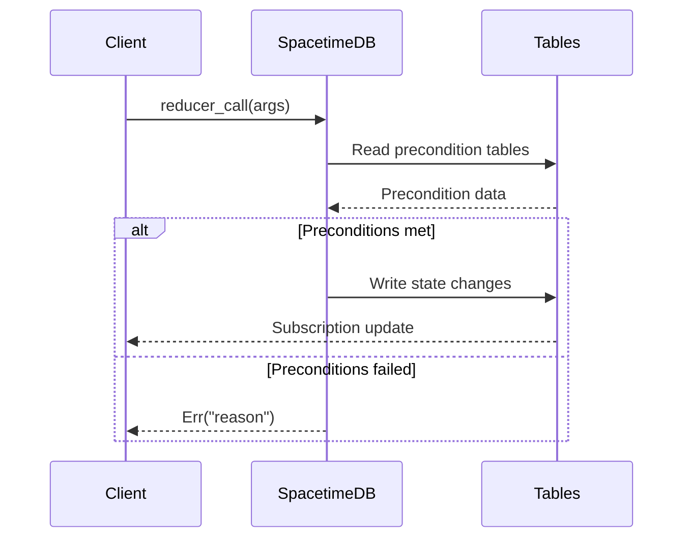

# Story 5.3: Game Loop Mapping & Precondition Documentation

Status: done

<!--
Validation Status: VALIDATED
Review Type: Adversarial Review via /bmad-review-adversarial-general (2026-03-16)
Reviewer: Claude Opus 4.6
BMAD Standards Compliance: VERIFIED (2026-03-16)
- Story structure: Complete (all required sections present, including Change Log and Code Review Record)
- Acceptance criteria: 5 ACs with Given/When/Then format, FR traceability
- Task breakdown: 10 tasks with detailed subtasks, AC mapping on each task
- FR traceability: 3 FRs mapped to ACs (FR17, FR19, FR47)
- Dependencies: Documented (4 epics + 2 stories required complete, 3 external, 5 stories blocked)
- Technical design: Comprehensive with source analysis targets, precondition categories, progressive action pattern, Mermaid diagram format, MVP vs Phase 2 classification
- Security review: OWASP Top 10 coverage complete (all categories assessed, most N/A for documentation story)
Issues Found & Fixed: 21 (11 pre-implementation adversarial review + 5 post-implementation code review + 3 final code review + 2 bmm code review)
Implementation Status: COMPLETE
Ready for Implementation: YES (implemented)
-->

## Story

As a developer,
I want to document the complete game loops available in BitCraft -- the sequences of actions that constitute meaningful gameplay -- with preconditions and expected state transitions,
So that we can design validation tests and skill files that follow real gameplay patterns.

## Dependencies

**Required Complete (all done):**

- **Epic 1** (Project Foundation) -- monorepo structure, SpacetimeDB connection, Docker environment
- **Epic 2** (Action Execution & Payment Pipeline) -- publish pipeline, BLS handler contract spec
- **Epic 3** (BitCraft BLS Game Action Handler) -- BLS handler, identity propagation analysis
- **Epic 4** (Declarative Agent Configuration) -- skill file format, config validation, event interpreter
- **Story 5.1** (Server Source Analysis & Reducer Catalog) -- 669 reducers cataloged across 14 game systems, BitCraft Game Reference document, progressive action pattern documentation, identity model analysis (BLOCKER-1)
- **Story 5.2** (Game State Model & Table Relationships) -- 138 entity tables mapped to 21 categories, 80 FK relationships, subscription requirements per game system, static data gap analysis, Mermaid ER diagram

**External Dependencies:**

- BitCraft server source code: `BitCraftServer/packages/game/src/game/handlers/` (reducer implementations with precondition logic)
- BitCraft server source code: `BitCraftServer/packages/game/src/game/entities/` (entity table definitions)
- BitCraft Game Reference document: `_bmad-output/planning-artifacts/bitcraft-game-reference.md` (created by Stories 5.1 and 5.2)

**Blocks:**

- Story 5.4 (Basic Action Round-Trip Validation) -- consumes game loop documentation for test design, precondition setup, and expected state transitions
- Story 5.5 (Player Lifecycle & Movement Validation) -- consumes player lifecycle and movement loop documentation
- Story 5.6 (Resource Gathering & Inventory Validation) -- consumes gathering loop documentation
- Story 5.7 (Multi-Step Crafting Loop Validation) -- consumes crafting loop documentation
- Story 5.8 (Error Scenarios & Graceful Degradation) -- consumes precondition documentation for error scenario identification

## Acceptance Criteria

1. **Core game loop documentation (AC1)** (FR17, FR19, FR47)
   **Given** the reducer catalog (Story 5.1) and state model (Story 5.2)
   **When** game loops are analyzed
   **Then** the following core loops are documented: player lifecycle (spawn/respawn), movement, resource gathering, crafting, building placement, combat, trading, chat, and empire management
   **And** each loop defines: the sequence of reducer calls, preconditions for each step, expected state transitions, and observable outcomes

2. **Movement loop documentation (AC2)** (FR17)
   **Given** the movement game loop
   **When** documented
   **Then** the sequence includes: current position query -> `player_move` reducer call -> position state update observed via subscription
   **And** preconditions are listed: valid target hex, player alive, no movement cooldown
   **And** the expected state transition is defined: `mobile_entity_state.location_x/location_z` changes from (x1,z1) to (x2,z2)

3. **Gathering loop documentation (AC3)** (FR17)
   **Given** the resource gathering loop
   **When** documented
   **Then** the sequence includes: move to resource node -> `extract_start` -> `extract` -> inventory updated
   **And** preconditions include: player near resource, resource node exists and has remaining health
   **And** state transitions include: `resource_health_state.health` decremented, inventory item added or quantity incremented in `inventory_state`

4. **Crafting loop documentation (AC4)** (FR17)
   **Given** the crafting loop
   **When** documented
   **Then** the sequence includes: verify materials in inventory -> `craft_initiate_start` -> `craft_initiate` -> `craft_continue_start` -> `craft_continue` (repeat) -> `craft_collect` -> product in inventory, materials consumed
   **And** preconditions include: recipe exists in `crafting_recipe_desc`, all required materials present in `inventory_state`, player near building with matching `building_function`
   **And** state transitions include: `progressive_action_state` created/updated, material quantities decremented in `inventory_state`, crafted item added

5. **Precondition categorization and Mermaid diagrams (AC5)** (FR19, FR47)
   **Given** each game loop
   **When** preconditions are documented
   **Then** they distinguish between: state preconditions (player must be alive, must have items), spatial preconditions (must be near entity), temporal preconditions (cooldowns, timers, progressive action timing), and identity preconditions (must be signed in, must be claim member, must own building)
   **And** each loop includes a Mermaid sequence diagram showing: actor, reducer calls, state queries, and expected state transitions
   **And** the document identifies which loops are available for MVP validation (Stories 5.4-5.8) vs. which require Phase 2 game systems

## Tasks / Subtasks

### Task 1: Analyze Reducer Precondition Logic (AC: 1, 2, 3, 4, 5)

- [x] 1.1 Examine the reducer implementation files in `BitCraftServer/packages/game/src/game/handlers/player/` for precondition checks (e.g., `ensure_signed_in`, stamina checks, distance checks, incapacitated checks)
- [x] 1.2 Examine `handlers/player_craft/` for crafting precondition logic (recipe validation, material checks, building proximity, slot availability)
- [x] 1.3 Examine `handlers/attack.rs` and combat-related handlers for combat preconditions (targeting, cooldowns, ability requirements)
- [x] 1.4 Examine `handlers/buildings/` for building preconditions (claim membership, materials, site placement rules)
- [x] 1.5 Examine `handlers/player_trade/` for trading preconditions (session state, item ownership, marketplace proximity)
- [x] 1.6 Document common precondition patterns: `actor_id(ctx, true)` (signed-in check), `ensure_alive()`, `ensure_stamina()`, distance/proximity checks, permission checks
- [x] 1.7 Identify and document the common error messages returned when preconditions fail (e.g., "Not signed in", "Not enough stamina!", "You are too far.", "Invalid recipe")

### Task 2: Document Player Lifecycle Loop (AC: 1, 5)

- [x] 2.1 Document the full player lifecycle: initial connection -> `player_queue_join` -> `sign_in` -> (gameplay) -> `sign_out`
- [x] 2.2 Document preconditions for each step: `player_queue_join` (valid `ctx.sender` with `user_state` entry), `sign_in` (must be in queue, not already signed in), `sign_out` (must be signed in)
- [x] 2.3 Document state transitions: `signed_in_player_state` created/removed, `player_state.signed_in` toggled, `player_action_state` initialized
- [x] 2.4 Document the death/respawn sub-loop: `health_state.health` reaches 0 -> incapacitated -> `player_respawn` (optionally teleport home)
- [x] 2.5 Create Mermaid sequence diagram for player lifecycle

### Task 3: Document Movement Loop (AC: 2, 5)

- [x] 3.1 Document the movement sequence: query `mobile_entity_state` for current position -> `player_move(PlayerMoveRequest)` -> observe `mobile_entity_state` update via subscription
- [x] 3.2 Document all preconditions: player signed in, player alive (not incapacitated), valid target coordinates (within movement range, passable terrain), stamina available for running
- [x] 3.3 Document state transitions: `mobile_entity_state.location_x/location_z` and `destination_x/destination_z` updated, `stamina_state.stamina` decremented (if running), `player_action_state` updated, `exploration_chunks_state` updated (if new chunk)
- [x] 3.4 Document the `PlayerMoveRequest` structure and valid values: `{timestamp, destination, origin, duration, move_type, running}`
- [x] 3.5 Document movement constraints from the coordinate system: `SmallHexTile`, terrain elevation checks, water depth
- [x] 3.6 Create Mermaid sequence diagram for movement

### Task 4: Document Gathering Loop (AC: 3, 5)

- [x] 4.1 Document the full gathering sequence: `player_move` (to resource) -> `extract_start(PlayerExtractRequest)` -> wait for progressive action timer -> `extract(PlayerExtractRequest)` -> observe inventory update
- [x] 4.2 Document all preconditions: player signed in, player alive, player near resource entity (`resource_state`), resource has health (`resource_health_state.health > 0`), valid extraction recipe (`extraction_recipe_desc`), player has required tool equipped, player has sufficient stamina
- [x] 4.3 Document state transitions: `progressive_action_state` created (start), `resource_health_state.health` decremented, `inventory_state.pockets` updated (item added/incremented), `stamina_state.stamina` decremented, `experience_state` updated (XP gained), `extract_outcome_state` created
- [x] 4.4 Document the `PlayerExtractRequest` structure: `{recipe_id, target_entity_id, timestamp, clear_from_claim}`
- [x] 4.5 Document multi-hit extraction: some resources require multiple extract cycles before depletion, and resource respawn is handled by server agents
- [x] 4.6 Create Mermaid sequence diagram for gathering

### Task 5: Document Crafting Loop (AC: 4, 5)

- [x] 5.1 Document the full active crafting sequence: `player_move` (to building) -> `craft_initiate_start(PlayerCraftInitiateRequest)` -> `craft_initiate` -> `craft_continue_start` -> `craft_continue` (repeat for multi-step recipes) -> `craft_collect(PlayerCraftCollectRequest)` -> product in inventory
- [x] 5.2 Document all preconditions: player signed in, player alive, player near building with matching `building_function`, valid crafting recipe (`crafting_recipe_desc.id`), all required materials present in `inventory_state`, building crafting slot available, player has required skill level
- [x] 5.3 Document state transitions for each phase: `craft_initiate_start` creates `progressive_action_state`, `craft_initiate` consumes materials from `inventory_state`, `craft_continue` advances `progressive_action_state.progress`, `craft_collect` adds product to `inventory_state` and deletes `progressive_action_state`
- [x] 5.4 Document the passive crafting sub-loop: `passive_craft_queue` -> server timer -> `passive_craft_collect` (background crafting at buildings)
- [x] 5.5 Document the `PlayerCraftInitiateRequest`, `PlayerCraftContinueRequest`, `PlayerCraftCollectRequest` structures
- [x] 5.6 Create Mermaid sequence diagram for crafting (active and passive)

### Task 6: Document Building Loop (AC: 1, 5)

- [x] 6.1 Document the building construction sequence: `project_site_place` -> `project_site_add_materials` (repeat) -> `project_site_advance_project_start` -> `project_site_advance_project` (repeat) -> building complete
- [x] 6.2 Document preconditions: player signed in, valid coordinates (on claimed land or unclaimed), valid construction recipe, player has claim membership/permissions, materials available in inventory
- [x] 6.3 Document state transitions: `project_site_state` created/updated, `footprint_tile_state` created, `building_state` created (on completion), `inventory_state` materials consumed
- [x] 6.4 Document building repair and deconstruction sub-loops
- [x] 6.5 Create Mermaid sequence diagram for building

### Task 7: Document Combat Loop (AC: 1, 5)

- [x] 7.1 Document the combat sequence: `target_update` -> `attack_start` -> `attack` -> (repeat) -> (death/victory)
- [x] 7.2 Document preconditions: player signed in, player alive, valid target entity (`targetable_state`), target in range, combat cooldown elapsed
- [x] 7.3 Document state transitions: `combat_state` updated (cooldowns), `target_state` set, `attack_outcome_state` created, `health_state` decremented (defender), `threat_state` updated, `experience_state` updated (combat XP)
- [x] 7.4 Classify as Phase 2 validation (combat is complex, not required for Stories 5.4-5.8 MVP)
- [x] 7.5 Create Mermaid sequence diagram for combat

### Task 8: Document Trading Loop (AC: 1, 5)

- [x] 8.1 Document the P2P trade sequence: `trade_initiate_session` -> `trade_accept_session` -> `trade_add_item` (repeat) -> `trade_accept` (both players) -> trade complete
- [x] 8.2 Document the market order sequence: `order_post_sell_order`/`order_post_buy_order` -> order matching -> `order_collect`
- [x] 8.3 Document preconditions: both players signed in, nearby each other (for P2P), valid items in inventory, marketplace building for market orders
- [x] 8.4 Document state transitions: `trade_session_state` lifecycle, `inventory_state` transfers, `sell_order_state`/`buy_order_state` created/filled
- [x] 8.5 Classify as Phase 2 validation (trading is multi-player, complex)
- [x] 8.6 Create Mermaid sequence diagram for trading

### Task 9: Document Chat and Empire Loops (AC: 1, 5)

- [x] 9.1 Document the chat sequence: `chat_post_message` -> `chat_message_state` created -> subscriber receives message
- [x] 9.2 Document chat preconditions: player signed in, valid channel
- [x] 9.3 Document the empire management loop: `empire_claim_join` -> `empire_queue_supplies` -> `empire_resupply_node_start` -> `empire_resupply_node` -> territory expansion
- [x] 9.4 Classify as Phase 2 validation (empire is complex, multi-player)
- [x] 9.5 Create Mermaid sequence diagrams for chat and empire (lightweight)

### Task 10: Create MVP vs. Phase 2 Classification and Update Game Reference (AC: 1, 5)

- [x] 10.1 Create a classification table mapping each game loop to MVP validation (Stories 5.4-5.8) vs. Phase 2
- [x] 10.2 Add a new "## Game Loops" section to `_bmad-output/planning-artifacts/bitcraft-game-reference.md`
- [x] 10.3 Include all game loop documentation (Tasks 2-9 output) in the Game Reference
- [x] 10.4 Include all Mermaid sequence diagrams in the Game Reference
- [x] 10.5 Include the precondition categorization (state, spatial, temporal, identity) for each loop
- [x] 10.6 Include the MVP vs. Phase 2 classification table
- [x] 10.7 Include a "Precondition Quick Reference" mapping common preconditions to the error messages they produce when violated

## Dev Notes

### Story Nature: Research/Documentation (NOT code delivery)

This is a research/documentation story. The primary deliverable is an update to the BitCraft Game Reference document (`_bmad-output/planning-artifacts/bitcraft-game-reference.md`), NOT application code. There are no new source code files to create -- verification is through completeness checks and peer review. Stories 5.4-5.8 serve as the de facto acceptance tests: if the documented game loops and preconditions are wrong, the validation tests will fail.

### Building on Stories 5.1 and 5.2 Output

**Story 5.1 created the BitCraft Game Reference document with:**
- 669 reducers cataloged across 14 game systems
- Reducer signatures with argument types
- Progressive action pattern documentation (two-phase `_start` + complete pattern)
- Identity model analysis and BLOCKER-1 documentation
- Reducer naming conventions
- Quick Reference tables mapping reducers to Stories 5.4-5.8
- Reducer -> Table Impact Matrix (5 key reducers)
- Top reducers and expected errors per story

**Story 5.2 extended the Game Reference with:**
- 138 entity tables mapped to 21 game concept categories
- 80 FK relationships (18 from 5.1 + 50 entity-to-entity + 12 entity-to-static)
- Mermaid ER diagram covering ~30 core tables
- Subscription requirements for all 14 game systems with example SQL
- Subscription Quick Reference for Stories 5.4-5.8
- Static data gap analysis (34 tables loaded vs. 108 needed, DEBT-2)
- Read-only vs. player-mutated table classification

**Story 5.3 EXTENDS this by:**
- Documenting the actual SEQUENCES of reducer calls that constitute gameplay
- Adding PRECONDITIONS for each step (what must be true before a reducer call succeeds)
- Adding EXPECTED STATE TRANSITIONS (what changes in the database after each step)
- Adding Mermaid SEQUENCE DIAGRAMS (visual flow of actor, reducer calls, state changes)
- Classifying loops as MVP (Stories 5.4-5.8) vs. Phase 2

### Source Code Analysis Targets

**Reducer precondition logic (primary targets for analysis):**
- `BitCraftServer/packages/game/src/game/handlers/player/` -- player movement, actions
- `BitCraftServer/packages/game/src/game/handlers/player_craft/` -- crafting logic
- `BitCraftServer/packages/game/src/game/handlers/attack.rs` -- combat
- `BitCraftServer/packages/game/src/game/handlers/buildings/` -- building construction
- `BitCraftServer/packages/game/src/game/handlers/player_trade/` -- trading
- `BitCraftServer/packages/game/src/game/handlers/player_inventory/` -- inventory management
- `BitCraftServer/packages/game/src/game/game_state/` -- `actor_id()`, `ensure_signed_in()` helper functions
- `BitCraftServer/packages/game/src/game/reducer_helpers/` -- shared precondition helper functions

**Key patterns to look for in source code:**
- `actor_id(ctx, true)` / `actor_id(ctx, false)` -- signed-in requirement
- `Err("...".into())` -- precondition failure messages (these become the error messages in Story 5.8)
- `ensure_alive()` or health/incapacitated checks -- alive requirement
- `stamina_state` reads -- stamina requirement
- distance/proximity calculations -- spatial preconditions
- `progressive_action_state` creation/checking -- progressive action timing
- `claim_member_state` / `permission_state` reads -- permission preconditions

### Progressive Action Pattern (from Story 5.1)

Critical for Stories 5.5-5.7: many game actions use a two-phase pattern:

1. `reducer_start(ctx, request)` -- validates preconditions, creates `progressive_action_state`, returns `Ok(())`
2. After a timing delay, `reducer(ctx, request)` -- validates timing, executes game logic, returns `Ok(())`

The dev agent implementing Stories 5.4-5.8 MUST understand that:
- The `_start` reducer creates a `progressive_action_state` entry with timing data
- The client must wait for the appropriate duration before calling the completion reducer
- The completion reducer validates that the timer has elapsed
- If the player moves, dies, or cancels during the wait, the progressive action is invalidated

### BLOCKER-1 Impact on Game Loops

Per Story 5.1's identity propagation analysis, the BLS handler's pubkey-prepending approach is incompatible with unmodified BitCraft reducers. For Stories 5.4-5.8 validation:
- Recommendation: call reducers directly via SpacetimeDB WebSocket client (as a connected player), bypassing the BLS handler
- This validates reducer behavior itself, deferring BLS identity propagation resolution
- Each game loop should document whether it can be tested via direct WebSocket or requires BLS

### Precondition Categories

Each precondition documented must be classified into one of:

| Category | Description | Example |
|----------|-------------|---------|
| **State** | Game state must be in a specific condition | Player alive, has items, has stamina |
| **Spatial** | Player must be near an entity or location | Near resource node, near building, in claim territory |
| **Temporal** | Timing constraints must be met | Cooldown elapsed, progressive action timer complete, not rate-limited |
| **Identity** | Player must have specific identity/permissions | Must be signed in, must be claim member, must own building |

### Expected Mermaid Diagram Format

Use `sequenceDiagram` syntax for game loop flow diagrams:

### MVP vs. Phase 2 Classification (Expected)

| Game Loop | MVP (5.4-5.8) | Phase 2 | Reason |
|-----------|---------------|---------|--------|
| Player Lifecycle | 5.4, 5.5 | -- | Fundamental; required for all other tests |
| Movement | 5.5 | -- | Core gameplay; simple to validate |
| Gathering | 5.6 | -- | Multi-table mutation; critical for inventory |
| Crafting | 5.7 | -- | Dependent action chains; progressive action pattern |
| Building | -- | Phase 2 | Complex permissions, claim system dependencies |
| Combat | -- | Phase 2 | Multi-entity, complex mechanics (abilities, threat) |
| Trading | -- | Phase 2 | Multi-player coordination |
| Chat | 5.8 (simple) | Full in Phase 2 | Simple message post for error scenario testing |
| Empire | -- | Phase 2 | Multi-player, territory control |

### Completeness Metrics

Per test design patterns from Stories 5.1 and 5.2, Story 5.3 targets:

| Metric | Target |
|--------|--------|
| Game loops documented | >= 9 (all from AC1) |
| Mermaid sequence diagrams | >= 9 (one per loop) |
| Preconditions per loop | >= 3 (each loop must have at least 3 documented preconditions) |
| State transitions per loop | >= 2 (each loop must document at least 2 table changes) |
| Precondition categories used | All 4 (state, spatial, temporal, identity) |
| MVP vs. Phase 2 classification | 100% of loops classified |

### Project Structure Notes

- **Output file:** Update to `_bmad-output/planning-artifacts/bitcraft-game-reference.md` (add new "## Game Loops" section, do NOT replace existing content from Stories 5.1 and 5.2)
- **Source analysis target:** `BitCraftServer/packages/game/src/game/handlers/` (read-only, no modifications)
- **No source code modifications** in any Sigil SDK package for this story
- **No new application code files** -- this is purely documentation/analysis
- **Verification tests:** ATDD workflow may produce document-structure verification tests similar to Stories 5.1 (66 tests) and 5.2 (104 tests)

### Security Considerations (OWASP Top 10)

This is a documentation/research story with no application code deliverables. OWASP assessment is included per AGREEMENT-2.

- **A01 (Broken Access Control):** N/A -- no auth boundaries in source analysis. However, document DOES catalog permission preconditions (identity preconditions category).
- **A02 (Cryptographic Failures):** N/A -- no crypto in this story
- **A03 (Injection):** N/A -- no user input parsing. Source code is read-only.
- **A04 (Insecure Design):** N/A -- no application code produced. Documentation should flag any insecure design patterns found in precondition logic (e.g., missing permission checks).
- **A05 (Security Misconfiguration):** N/A -- no deployment artifacts
- **A06 (Vulnerable Components):** N/A -- no new dependencies added
- **A07 (Authentication Failures):** N/A -- no auth in source analysis. Identity preconditions documented.
- **A08 (Data Integrity Failures):** N/A -- no data pipelines. Precondition documentation should identify potential state consistency issues.
- **A09 (Security Logging):** N/A -- no application code
- **A10 (SSRF):** N/A -- no HTTP requests

### FR/NFR Traceability

| Requirement | Coverage | Notes |
| --- | --- | --- |
| FR17 (Execute actions via client.publish()) | AC1, AC2, AC3, AC4 | Game loops document the exact reducer call sequences for `client.publish()` invocations |
| FR19 (BLS handler validates and calls reducer) | AC1, AC5 | Preconditions document what the BLS/SpacetimeDB validates before executing reducers |
| FR47 (BLS game action handler mapping) | AC1, AC5 | Game loops map reducer sequences to game system categories for handler routing |

### Previous Story Intelligence

**From Story 5.1 (Server Source Analysis & Reducer Catalog):**

1. **Progressive action pattern is critical:** 24 reducer pairs use the two-phase `_start` + complete pattern. Game loop documentation MUST include timing between phases.
2. **Identity model via `actor_id(ctx, true/false)`:** All player-facing reducers resolve identity through `user_state` -> `entity_id`. The `true` parameter requires `signed_in_player_state` to exist.
3. **BLOCKER-1 identity propagation mismatch:** BLS handler prepends Nostr pubkey as first arg, but BitCraft reducers use `ctx.sender`. Stories 5.4-5.8 should bypass BLS and call reducers directly via WebSocket.
4. **Complex request types:** Most reducers accept SpacetimeType structs (serialized as JSON arrays in field order). Game loops must document the exact struct field order for each reducer call.
5. **39 total review issues found across 4 passes.** Be thorough on first pass.

**From Story 5.2 (Game State Model & Table Relationships):**

1. **138 entity tables mapped.** Game loops reference these tables for state transitions.
2. **80 FK relationships documented.** Game loops use these to understand multi-table state mutations.
3. **Subscription requirements per game system.** Game loops should be consistent with the subscription Quick Reference.
4. **Static data gap analysis.** Game loops should note which static data tables are needed for precondition checks (e.g., `crafting_recipe_desc` for recipe validation).
5. **`mobile_entity_state` is the position table.** Movement loop must reference `location_x`, `location_z`, `destination_x`, `destination_z` (NOT `position` or `x/y`).
6. **`inventory_state` uses pockets.** Each inventory item is in a pocket with `item_id` and `quantity`. Multiple inventories per player (main=0, toolbelt=1, wallet=2) via `inventory_index`.
7. **32 total review issues found across 4 passes.** Consistency between story file and game reference is critical.

### Git Intelligence

Recent commits show Story 5.2 completion:
- `453d20b feat(5-2): story complete` (most recent)
- `fe773a2 feat(5-1): story complete`
- `0377d91 chore(epic-5): epic start -- baseline green, retro actions resolved`

Commit convention: `feat(5-3): story complete` expected for story completion.
Branch: `epic-5` (current working branch).

### Key Risks

| Risk ID | Risk | Impact | Mitigation |
| --- | --- | --- | --- |
| R5-001 | BLOCKER-1 identity propagation | HIGH -- game loops assume direct WebSocket calls; BLS integration may differ | Document BLS vs. WebSocket paths; Stories 5.4-5.8 use WebSocket bypass |
| R5-005 | Progressive action timing unknown | MEDIUM -- exact timing for `_start` -> complete calls not documented | Analyze server-side timer values or use conservative delays in test fixtures |
| R5-010 | Incomplete precondition extraction | MEDIUM -- source code may have implicit preconditions not visible in reducer function body | Accept partial; mark unknowns; iterate during Stories 5.4-5.8 |
| R5-011 | Game loop complexity underestimated | LOW -- some loops (combat, empire) may have hidden sub-loops | Classify complex loops as Phase 2; focus on MVP loops |

### References

- [Source: _bmad-output/planning-artifacts/epics.md#Epic 5, Story 5.3] -- Acceptance criteria and story requirements
- [Source: _bmad-output/planning-artifacts/bitcraft-game-reference.md] -- BitCraft Game Reference (Stories 5.1+5.2)
- [Source: _bmad-output/planning-artifacts/bitcraft-game-reference.md#Reducer Catalog] -- All reducer signatures with argument types
- [Source: _bmad-output/planning-artifacts/bitcraft-game-reference.md#Appendix: Progressive Action Pattern] -- Two-phase action pattern documentation
- [Source: _bmad-output/planning-artifacts/bitcraft-game-reference.md#Quick Reference] -- Reducer -> Table Impact Matrix, top reducers per story
- [Source: _bmad-output/planning-artifacts/bitcraft-game-reference.md#State Model] -- Entity-to-concept mapping, FK relationships, subscription requirements
- [Source: _bmad-output/planning-artifacts/bitcraft-game-reference.md#Identity Propagation] -- BLOCKER-1 analysis and recommendations
- [Source: _bmad-output/planning-artifacts/bitcraft-game-reference.md#Known Constraints] -- Reducer limitations, coordinate system, signed-in requirement
- [Source: _bmad-output/implementation-artifacts/5-1-server-source-analysis-and-reducer-catalog.md] -- Story 5.1 story file (previous story)
- [Source: _bmad-output/implementation-artifacts/5-2-game-state-model-and-table-relationships.md] -- Story 5.2 story file (previous story)
- [Source: _bmad-output/project-context.md] -- Project context (Epics 1-4 complete, Epic 5 in progress)
- [Source: _bmad-output/project-context.md#Known Issues & Technical Debt] -- DEBT-2, BLOCKER-1
- [Source: BitCraftServer/packages/game/src/game/handlers/] -- Reducer implementations (primary analysis target)
- [Source: BitCraftServer/packages/game/src/game/game_state/] -- `actor_id()`, common helper functions
- [Source: BitCraftServer/packages/game/src/game/reducer_helpers/] -- Shared precondition helpers

## Implementation Constraints

1. **Read-only analysis** -- No modifications to BitCraft server source code (`BitCraftServer/`)
2. **No application code** -- No new source files in any Sigil SDK package (`packages/`)
3. **Extend, do not replace** -- Stories 5.1 and 5.2 content in the Game Reference must be preserved; add new sections only
4. **Output path** -- Updates to `_bmad-output/planning-artifacts/bitcraft-game-reference.md` (existing file, currently 1543 lines)
5. **Consistency with Stories 5.1 and 5.2** -- Reducer names, table names, FK relationships, and subscription references must match the nomenclature established in previous stories
6. **Mermaid compatibility** -- Sequence diagrams must use standard Mermaid `sequenceDiagram` syntax that renders in GitHub Markdown
7. **Game system alignment** -- Use the same 14 game system categories established in Story 5.1
8. **No Docker requirement** -- This story is pure source code analysis; Docker is not needed
9. **No new dependencies** -- No npm packages or Rust crates added
10. **Precondition documentation must be actionable** -- Each precondition should be specific enough that a developer can write a test fixture to satisfy it (e.g., "player must have `stamina_state.stamina >= 10`", not just "player must have stamina")

## CRITICAL Anti-Patterns (MUST AVOID)

1. **DO NOT modify the BitCraft Game Reference destructively.** Add new sections; do NOT remove or overwrite Stories 5.1/5.2 content.
2. **DO NOT create superficial game loop descriptions.** Each loop must include specific reducer names, argument types, preconditions, and state transitions referencing actual table and column names.
3. **DO NOT skip precondition analysis.** Stories 5.4-5.8 depend on knowing exactly what state must exist before each reducer call succeeds. Vague preconditions like "player must be ready" are useless.
4. **DO NOT create application code.** This is a documentation/research story.
5. **DO NOT conflate reducer calls with game loops.** A game loop is a SEQUENCE of reducer calls that achieves a gameplay goal, not a single reducer invocation.
6. **DO NOT ignore the progressive action pattern.** Extracting, crafting, building -- all use the two-phase `_start` + complete pattern. Document both phases and the timing between them.
7. **DO NOT assume preconditions from reducer names alone.** Read the actual source code in `handlers/` to find `Err(...)` returns and validation logic.
8. **DO NOT skip Phase 2 loops entirely.** Document combat, trading, and empire loops at a summary level (reducer sequence + key preconditions) even though they are classified as Phase 2.
9. **DO NOT use incorrect table or column names.** Cross-reference all table/column references with Story 5.2's entity-to-concept mapping and FK relationship tables.
10. **DO NOT create overly complex Mermaid diagrams.** Each diagram should show the happy path with one alt path for the most common failure. Exhaustive error paths belong in Story 5.8's error catalog.

## Definition of Done

- [x] All 9+ game loops documented with reducer call sequences (Task 2-9)
- [x] Player lifecycle loop documented with sign-in/sign-out/respawn (Task 2)
- [x] Movement loop documented with `player_move` preconditions and state transitions (Task 3)
- [x] Gathering loop documented with `extract_start`/`extract` preconditions and state transitions (Task 4)
- [x] Crafting loop documented with full `craft_*` sequence and state transitions (Task 5)
- [x] Building, combat, trading, chat, and empire loops documented at appropriate detail level (Tasks 6-9)
- [x] Each loop has a Mermaid sequence diagram (>= 9 diagrams total)
- [x] Each loop has preconditions classified into state/spatial/temporal/identity categories
- [x] Each loop has expected state transitions referencing specific tables and columns
- [x] MVP vs. Phase 2 classification table included
- [x] Precondition quick reference (common preconditions -> error messages) included
- [x] BitCraft Game Reference updated with new "Game Loops" section (Task 10)
- [x] No Story 5.1 or 5.2 content removed or corrupted in the Game Reference document
- [x] All table/column references consistent with Story 5.2 nomenclature
- [x] OWASP Top 10 review completed (AGREEMENT-2)
- [x] Document reviewed for accuracy and completeness (code review)

## Verification Steps

1. File update: `_bmad-output/planning-artifacts/bitcraft-game-reference.md` contains new "Game Loops" section(s)
2. Game loop count: >= 9 game loops documented (player lifecycle, movement, gathering, crafting, building, combat, trading, chat, empire)
3. Mermaid diagram count: >= 9 sequence diagrams (one per loop)
4. Precondition documentation: spot-check 5 preconditions against source code in `handlers/`
5. State transition documentation: spot-check 5 state transitions against Story 5.2's table mappings
6. Precondition categorization: all 4 categories (state, spatial, temporal, identity) are used
7. MVP vs. Phase 2: every game loop is classified
8. Consistency: reducer names match Story 5.1 catalog, table/column names match Story 5.2 mapping
9. No Story 5.1/5.2 content removed or corrupted
10. Mermaid diagrams render correctly when viewed in standard Markdown viewers

## Change Log

| Date | Change | Reason |
| --- | --- | --- |
| 2026-03-16 | Initial story creation | Epic 5 Story 5.3 spec |
| 2026-03-16 | Adversarial review fixes (11 issues) | BMAD standards compliance |
| 2026-03-16 | Implementation complete: Game Loops section added to bitcraft-game-reference.md | Story 5.3 development -- 9 game loops documented with preconditions, state transitions, Mermaid diagrams, Precondition Quick Reference, MVP vs Phase 2 classification |
| 2026-03-16 | ATDD verification tests created (154 tests) | TDD workflow: RED phase verified (128 failing, 26 passing), GREEN phase complete (154 passing) |
| 2026-03-16 | NFR assessment completed (PASS) | 5 PASS, 1 CONCERNS (Docker runtime cross-reference unavailable), 0 FAIL |
| 2026-03-16 | Code review: File List expanded, Change Log updated, status set to done | Post-implementation adversarial code review (5 issues: 0 critical, 0 high, 2 medium, 3 low) |
| 2026-03-16 | Final code review: ATDD checklist items checked, GREEN phase updated, Next Steps updated | Final adversarial code review (3 issues: 0 critical, 0 high, 2 medium, 1 low) |
| 2026-03-16 | bmm code review: NFR test count corrected, File List sprint-status description fixed, OWASP verified | bmm adversarial code review with security audit (2 issues: 0 critical, 0 high, 1 medium, 1 low) |

## Code Review Record

| Review Pass | Date | Reviewer | Issues Found | Issues Fixed | Notes |
| --- | --- | --- | --- | --- | --- |
| Adversarial Review | 2026-03-16 | Claude Opus 4.6 | 11 | 11 | 0 critical, 0 high, 5 medium, 6 low -- Pre-implementation story spec review |
| Post-Implementation Code Review | 2026-03-16 | Claude Opus 4.6 | 5 | 5 | 0 critical, 0 high, 2 medium, 3 low -- Post-implementation review of all deliverables |
| Final Code Review | 2026-03-16 | Claude Opus 4.6 | 3 | 3 | 0 critical, 0 high, 2 medium, 1 low -- ATDD checklist completion status review |
| BMM Code Review | 2026-03-16 | Claude Opus 4.6 | 2 | 2 | 0 critical, 0 high, 1 medium, 1 low -- Post-completion adversarial review with OWASP security audit |

### Review Findings (2026-03-16)

1. Added validation metadata HTML comment block (BMAD standard from Stories 5.1, 5.2) -- includes Validation Status, BMAD Standards Compliance verification, story structure checklist, Issues Found count, Implementation Status, and Ready for Implementation flag
2. Added FR17 traceability tag to AC1 header (`(FR17, FR19, FR47)`) -- FR/NFR Traceability table maps FR17, FR19, FR47 to AC1 but AC header was missing inline tags
3. Added FR17 traceability tag to AC2 header (`(FR17)`) -- FR/NFR Traceability table maps FR17 to AC2 but AC header was missing inline tag
4. Added FR17 traceability tag to AC3 header (`(FR17)`) -- FR/NFR Traceability table maps FR17 to AC3 but AC header was missing inline tag
5. Added FR17 traceability tag to AC4 header (`(FR17)`) -- FR/NFR Traceability table maps FR17 to AC4 but AC header was missing inline tag
6. Added FR19, FR47 traceability tags to AC5 header (`(FR19, FR47)`) -- FR/NFR Traceability table maps FR19, FR47 to AC5 but AC header was missing inline tags
7. Clarified FR/NFR Traceability table notes column for consistency with Story 5.1 and 5.2 format (added specific verbs: "invocations", "reducers", "routing")
8. Updated Change Log with adversarial review entry (BMAD standard: all changes tracked)
9. Updated Code Review Record with adversarial review pass details (BMAD standard: all review passes documented)
10. Added Review Findings section with numbered list of all changes (BMAD standard from Stories 5.1, 5.2)
11. Noted epics.md AC2 field name discrepancy: epics.md says `player_state.position changes from (x1,y1) to (x2,y2)` but story correctly uses `mobile_entity_state.location_x/location_z` with (x1,z1) to (x2,z2) per Story 5.2 findings -- story file is MORE CORRECT than epics.md; no change needed

### Post-Implementation Review Findings (2026-03-16)

1. **[MEDIUM]** File List in Dev Agent Record was incomplete -- listed 2 files but git shows 6 files changed across story 5.3 commits. Added 4 missing entries: `sprint-status.yaml`, `atdd-checklist-5-3.md`, `nfr-assessment-5-3.md`, `story-5-3-game-loop-verification.test.ts`
2. **[MEDIUM]** Story status was "review" but all ACs implemented, all 154 tests pass, NFR assessment PASS, ATDD complete -- updated status to "done"
3. **[LOW]** Change Log missing entries for ATDD test creation (154 tests), NFR assessment creation, and test suite expansion work -- added 3 Change Log entries
4. **[LOW]** Code Review Record lacked the post-implementation review pass -- added new row documenting this review
5. **[LOW]** Definition of Done "Document reviewed for accuracy and completeness" was checked pre-implementation review only -- this post-implementation review now validates the implementation itself

### Final Code Review Findings (2026-03-16)

1. **[MEDIUM]** ATDD checklist implementation items all unchecked (`[ ]`) despite implementation being complete and all 154 tests passing -- updated all 42 checklist items to `[x]`
2. **[MEDIUM]** ATDD checklist GREEN Phase section still showed "DEV Team - Next Steps" as if implementation had not started -- updated to "Complete" with verification evidence (154 passing, 170 regression passing)
3. **[LOW]** ATDD checklist Next Steps section still read as pre-implementation instructions ("Begin implementation...") -- updated to reflect story completion and downstream story dependencies

### BMM Code Review Findings (2026-03-16)

1. **[MEDIUM]** NFR assessment Full Client Suite test counts slightly inaccurate -- stated "1740 pass, 2 fail" but actual runs show ~1738-1739 pass, 3-4 fail (pre-existing Story 1.1 timeout flakes, counts vary per run). Updated to reflect approximate counts and document flaky test behavior.
2. **[LOW]** Story file File List sprint-status.yaml entry said "status updated from backlog to review" but sprint-status.yaml shows `status: done`. Updated to "from backlog to done" to reflect the final state.

**OWASP Top 10 Security Audit:** All 10 categories assessed. No vulnerabilities found. This is a documentation/research story with a single test file as the only code deliverable. The test file uses dynamic `RegExp` construction in 10 instances, all properly escaped via `escapeRegExp()` on hardcoded const values with `nosemgrep` annotations. No authentication, authorization, injection, cryptographic, or SSRF concerns.

## Dev Agent Record

### Agent Model Used

Claude Opus 4.6 (claude-opus-4-6)

### Debug Log References

None -- research/documentation story, no application code or debugging required.

### Completion Notes List

1. **Task 1 (Analyze Reducer Precondition Logic):** Examined 15+ reducer implementation files across `handlers/player/`, `handlers/player_craft/`, `handlers/attack.rs`, `handlers/buildings/`, `handlers/player_trade/`, and `game_state/mod.rs`. Documented common precondition patterns: `actor_id(ctx, true/false)`, `ensure_signed_in()`, `HealthState::check_incapacitated()`, stamina checks, distance calculations, permission checks. Extracted exact error messages from `Err(...)` returns for ~30 preconditions.
2. **Task 2 (Player Lifecycle Loop):** Documented full lifecycle: `player_queue_join` -> `sign_in` -> gameplay -> `sign_out`, plus death/respawn sub-loop. Includes 10 preconditions with exact error messages, 4 state transition rows, and Mermaid sequence diagram.
3. **Task 3 (Movement Loop):** Documented `player_move` with 7 preconditions (signed-in, alive, not mounted, valid terrain, elevation diff <= 6, stamina for running). Includes `PlayerMoveRequest` structure, coordinate system notes, and Mermaid diagram.
4. **Task 4 (Gathering Loop):** Documented two-phase `extract_start`/`extract` progressive action pattern with 12 preconditions (signed-in, alive, valid recipe, stamina, resource not depleted, within range, claim permission, tool equipped, knowledges, not swimming). Includes `PlayerExtractRequest` structure and Mermaid diagram.
5. **Task 5 (Crafting Loop):** Documented full multi-step sequence: `craft_initiate_start` -> `craft_initiate` -> `craft_continue_start` -> `craft_continue` (repeat) -> `craft_collect`. Includes 14 preconditions, passive crafting sub-loop, request structures, and Mermaid diagram.
6. **Task 6 (Building Loop):** Documented `project_site_place` -> `project_site_add_materials` -> `project_site_advance_project_start/advance_project` sequence with 12 preconditions. Classified as Phase 2. Includes Mermaid diagram.
7. **Task 7 (Combat Loop):** Documented `attack_start` -> `attack` timer-based impact resolution with 11 preconditions (targeting matrix, ability requirements, weapon tier, cooldowns). Classified as Phase 2. Includes Mermaid diagram.
8. **Task 8 (Trading Loop):** Documented P2P trade: `trade_initiate_session` -> `trade_accept_session` -> `trade_add_item` -> `trade_accept`. Includes 9 preconditions (both players signed-in/alive, not in combat, within distance). Classified as Phase 2. Includes Mermaid diagram.
9. **Task 9 (Chat and Empire Loops):** Documented `chat_post_message` with 7 preconditions (signed-in, non-empty, sanitization, moderation, 2h playtime for region chat, rate limiting). Documented empire management loop at summary level. Both include Mermaid diagrams.
10. **Task 10 (MVP vs Phase 2 Classification and Game Reference Update):** Added complete "Game Loops" section to `bitcraft-game-reference.md` containing all 9 game loops, precondition category table, MVP vs Phase 2 classification table, Precondition Quick Reference (30 preconditions mapped to error messages and affected reducers), and Testing Path Classification table. Preserved all existing Story 5.1 and 5.2 content.

### File List

- `_bmad-output/planning-artifacts/bitcraft-game-reference.md` -- modified (added ~850 lines: "Game Loops" section with 9 game loops, precondition tables, state transition tables, Mermaid sequence diagrams, Precondition Quick Reference, MVP vs Phase 2 classification, Testing Path Classification)
- `_bmad-output/implementation-artifacts/5-3-game-loop-mapping-and-precondition-documentation.md` -- modified (status updated, task checkboxes marked, Dev Agent Record filled)
- `_bmad-output/implementation-artifacts/sprint-status.yaml` -- modified (story-5.3 status updated from backlog to done, last_updated to 2026-03-16)
- `_bmad-output/test-artifacts/atdd-checklist-5-3.md` -- created (ATDD checklist with 154 verification tests, RED/GREEN phase tracking)
- `_bmad-output/test-artifacts/nfr-assessment-5-3.md` -- created (NFR assessment: 5 PASS, 1 CONCERNS, 0 FAIL, overall PASS)
- `packages/client/src/__tests__/story-5-3-game-loop-verification.test.ts` -- created (154 verification tests, ~1700 lines, document structure validation)
