# BitCraft Game Reference

**Generated:** 2026-03-15
**Source:** `BitCraftServer/packages/game/src/` (Apache 2.0 fork, read-only analysis)
**Purpose:** Authoritative reference for Stories 5.2-5.8, skill file construction, and `client.publish()` call validation

---

## Overview

### Server Architecture Summary

The BitCraft game server is a SpacetimeDB module (compiled to WASM) that implements a multiplayer crafting/exploration MMO. The server is organized as a Rust crate with the following key directories:

```
BitCraftServer/packages/game/src/
  lib.rs                    # Module entry point, world generation reducers, agent lifecycle
  import_reducers.rs        # Auto-generated import/stage reducer declarations
  i18n.rs                   # Internationalization strings
  agents/                   # 21 server-side scheduled agents (background game loops)
  game/
    handlers/               # Player-callable and server-callable reducers (~398 game reducers)
      admin/                # 44 admin/GM reducers
      buildings/            # 10 building management reducers
      cheats/               # 41 cheat/debug reducers
      claim/                # 22 claim (land ownership) reducers
      dev/                  # 3 dev-only reducers
      empires/              # 9 empire system reducers
      inventory/            # 10 inventory management reducers
      migration/            # 9 data migration reducers
      player/               # ~70 player action reducers (movement, gathering, combat, etc.)
      player_craft/         # 14 crafting reducers
      player_inventory/     # 7 equipment/item use reducers
      player_trade/         # 13 trading reducers (P2P + barter stall)
      player_vault/         # 11 deployable/collectible management reducers
      queue/                # 4 player queue/grace period reducers
      rentals/              # 12 rental system reducers
      resource/             # 3 resource respawn reducers
      server/               # 14 server-internal reducers
      stats/                # 2 stats logging reducers
      world/                # 3 world generation reducers
      attack.rs             # 5 combat/attack reducers
      authentication.rs     # Authentication helpers (not a reducer)
      target_update.rs      # 1 targeting reducer
    entities/               # 82 entity/state table definitions
    static_data/            # 9 static data table definition files
    autogen/                # Auto-generated code (148 import_* reducers, 88 stage_* reducers)
    coordinates/            # Hex coordinate system (SmallHexTile, LargeHexTile, FloatHexTile)
    game_state/             # Game state management (actor_id lookup, unix time helpers)
    reducer_helpers/        # Shared reducer helper functions
    discovery/              # Knowledge/discovery system
    generic/                # Generic game utilities
    unity_helpers/          # Unity client compatibility
    world_gen/              # World generation algorithms
  inter_module/             # Cross-module messaging
  macros/                   # Rust macros
  messages/                 # SpacetimeDB message types (action requests, components, etc.)
  table_caches/             # Table caching utilities
  utils/                    # Version and utility reducers
```

### Module Structure

The module contains approximately **669 reducers** total, broken down as:

| Category | Count | Description |
|----------|-------|-------------|
| Player-Facing Game Reducers | ~180 | Reducers callable by game clients (movement, crafting, trading, etc.) |
| Server-Internal Reducers | ~30 | Timer-based, server-to-server reducers (despawn, teleport, etc.) |
| Agent Loop Reducers | ~21 | Scheduled background tasks (regen, decay, AI, day/night) |
| Admin/GM Reducers | ~44 | Game master tools and admin operations |
| Cheat/Debug Reducers | ~41 | Developer debug commands |
| Migration Reducers | ~9 | One-time data migration reducers |
| Import Reducers | ~176 | Auto-generated state/data import reducers (`import_*`) |
| Stage Reducers | ~88 | Auto-generated static data staging reducers (`stage_*`) |
| Data Management | ~5 | `clear_staged_static_data`, `commit_staged_static_data`, `load_config`, etc. |
| World Generation | ~7 | `generate_world`, `generate_dev_island`, `start_generating_world`, etc. |
| Other Utility | ~68 | Quest, onboarding, housing, rental, claim tech, etc. |

### Identity Model

**SpacetimeDB Identity:** All reducers receive a `ctx: &ReducerContext` parameter. The caller's identity is accessed via `ctx.sender`, which is a SpacetimeDB `Identity` type (256-bit hash).

**Player Resolution:** The function `game_state::actor_id(ctx, must_be_signed_in)` looks up `ctx.sender` in the `user_state` table to find the player's `entity_id` (a `u64`). This is the primary mechanism by which reducers know which player is acting.

**No explicit identity parameter:** Unmodified BitCraft reducers do NOT accept an identity string as a parameter. They rely entirely on `ctx.sender` from the SpacetimeDB framework.

---

## Reducer Catalog

### Movement System

Reducers for player and entity movement, climbing, teleportation, and elevator use.

**Typical invocation sequence:** `sign_in` -> `player_move` (repeated) -> `player_climb` -> `player_teleport_home` / `player_teleport_waystone` -> `sign_out`

| Reducer | Signature | Notes |
|---------|-----------|-------|
| `player_move` | `(ctx, request: PlayerMoveRequest) -> Result<(), String>` | Primary movement. Request: `{timestamp: u64, destination: Option<OffsetCoordinatesFloat>, origin: Option<OffsetCoordinatesFloat>, duration: f32, move_type: i32, running: bool}` |
| `player_climb` | `(ctx, request: PlayerClimbRequest) -> Result<(), String>` | Climb action. Request: `{destination: OffsetCoordinatesFloat, origin: OffsetCoordinatesFloat, timestamp: u64, climb_type: i32}` |
| `player_climb_start` | `(ctx, request: PlayerClimbRequest) -> Result<(), String>` | Start-phase of climb (progressive action pattern) |
| `player_teleport_home` | `(ctx, _request: PlayerTeleportHomeRequest) -> Result<(), String>` | Teleport to home location. Request: `{dummy: i32}` |
| `player_teleport_home_start` | `(ctx, request: PlayerTeleportHomeRequest) -> Result<(), String>` | Start-phase of home teleport |
| `player_teleport_waystone` | `(ctx, request: PlayerTeleportWaystoneRequest) -> Result<(), String>` | Waystone teleport. Request: `{entity_id_from: u64, entity_id_to: u64}` |
| `player_teleport_waystone_start` | `(ctx, request: PlayerTeleportWaystoneRequest) -> Result<(), String>` | Start-phase of waystone teleport |
| `player_use_elevator` | `(ctx, platform_entity_id: u64) -> Result<(), String>` | Use building elevator |
| `player_region_crossover` | `(ctx) -> Result<(), String>` | Region boundary crossing |
| `deployable_move` | `(ctx, request: PlayerDeployableMoveRequest) -> Result<(), String>` | Move a deployable. Request: `{deployable_entity_id: u64, timestamp: u64, destination/origin: Option<OffsetCoordinatesFloat>, duration: f32}` |
| `deployable_follow` | `(ctx, request: PlayerDeployableMoveRequest) -> Result<(), String>` | Deployable follow mode |
| `deployable_mount` | `(ctx, request: PlayerDeployableMountRequest) -> Result<(), String>` | Mount a deployable (e.g., horse). Request: `{deployable_entity_id: u64}` |
| `deployable_dismount` | `(ctx, request: PlayerDeployableDismountRequest) -> Result<(), String>` | Dismount from deployable |
| `emote` | `(ctx, request: PlayerEmoteRequest) -> Result<(), String>` | Play emote. Request: `{emote_id: i32, face: Option<OffsetCoordinatesSmallMessage>}` |
| `emote_start` | `(ctx, request: PlayerEmoteRequest) -> Result<(), String>` | Start-phase of emote |
| `portal_enter` | `(ctx, request: PlayerPortalEnterRequest) -> Result<(), String>` | Enter a portal. Request: `{portal_entity_id: u64}` |

### Gathering System

Reducers for resource extraction (mining, foraging, harvesting) and prospecting.

**Typical invocation sequence:** `player_move` (to resource) -> `extract_start` -> `extract` -> (repeat for multi-hit resources)

| Reducer | Signature | Notes |
|---------|-----------|-------|
| `extract` | `(ctx, request: PlayerExtractRequest) -> Result<(), String>` | Complete extraction. Request: `{recipe_id: i32, target_entity_id: u64, timestamp: u64, clear_from_claim: bool}` |
| `extract_start` | `(ctx, request: PlayerExtractRequest) -> Result<(), String>` | Start-phase of extraction (progressive action) |
| `prospect` | `(ctx, prospecting_id: i32, timestamp: u64) -> Result<(), String>` | Prospecting action |
| `prospect_start` | `(ctx, prospecting_id: i32, timestamp: u64) -> Result<(), String>` | Start-phase of prospecting |

### Crafting System

Reducers for active crafting, passive (background) crafting, and item conversion.

**Typical invocation sequence:** `player_move` (to building) -> `craft_initiate_start` -> `craft_initiate` -> `craft_continue_start` -> `craft_continue` (repeat) -> `craft_collect`

| Reducer | Signature | Notes |
|---------|-----------|-------|
| `craft_initiate_start` | `(ctx, request: PlayerCraftInitiateRequest) -> Result<(), String>` | Start new craft. Request: `{recipe_id: i32, building_entity_id: u64, count: i32, timestamp: u64, is_public: bool}` |
| `craft_initiate` | `(ctx, request: PlayerCraftInitiateRequest) -> Result<(), String>` | Complete initiation phase |
| `craft_continue_start` | `(ctx, request: PlayerCraftContinueRequest) -> Result<(), String>` | Continue crafting. Request: `{progressive_action_entity_id: u64, timestamp: u64}` |
| `craft_continue` | `(ctx, request: PlayerCraftContinueRequest) -> Result<(), String>` | Complete continuation phase |
| `craft_collect` | `(ctx, request: PlayerCraftCollectRequest) -> Result<(), String>` | Collect finished items. Request: `{pocket_id: u64, recipe_id: i32}` |
| `craft_collect_all` | `(ctx, request: PlayerCraftCollectAllRequest) -> Result<(), String>` | Collect all finished items from building. Request: `{building_entity_id: u64}` |
| `craft_cancel` | `(ctx, request: PlayerCraftCancelRequest) -> Result<(), String>` | Cancel in-progress craft. Request: `{pocket_id: u64}` |
| `craft_set_public` | `(ctx, progressive_action_entity_id: u64, is_public: bool) -> Result<(), String>` | Toggle public craft access |
| `passive_craft_queue` | `(ctx, request: PlayerPassiveCraftQueueRequest) -> Result<(), String>` | Queue passive craft. Request: `{recipe_id: i32, building_entity_id: u64}` |
| `passive_craft_collect` | `(ctx, passive_craft_entity_id: u64) -> Result<(), String>` | Collect from passive craft |
| `passive_craft_collect_all` | `(ctx, building_entity_id: u64) -> Result<(), String>` | Collect all from building passive crafts |
| `passive_craft_cancel` | `(ctx, passive_craft_entity_id: u64) -> Result<(), String>` | Cancel passive craft |
| `item_convert` | `(ctx, request: PlayerItemConvertRequest) -> Result<(), String>` | Convert items. Request: `{conversion_recipe_id: u32, location_context: u32, count: u32, timestamp: u64}` |
| `item_convert_start` | `(ctx, request: PlayerItemConvertRequest) -> Result<(), String>` | Start item conversion |

### Combat System

Reducers for attacking, targeting, abilities, dueling, and death/respawn.

**Typical invocation sequence:** `target_update` -> `attack_start` -> `attack` -> (repeat) -> (server triggers `player_death_start` if HP reaches 0) -> `player_respawn`

| Reducer | Signature | Notes |
|---------|-----------|-------|
| `attack_start` | `(ctx, request: EntityAttackRequest) -> Result<(), String>` | Start attack. Request: `{attacker_entity_id: u64, defender_entity_id: u64, combat_action_id: i32, attacker_type: EntityType, defender_type: EntityType}` |
| `attack` | `(ctx, request: EntityAttackRequest) -> Result<(), String>` | Execute attack |
| `target_update` | `(ctx, request: TargetUpdateRequest) -> Result<(), String>` | Update target. Request: `{owner_entity_id: u64, target_entity_id: u64, generate_aggro: bool}` |
| `player_respawn` | `(ctx, teleport_home: bool) -> Result<(), String>` | Respawn after death |
| `player_duel_initiate` | `(ctx, target_player_entity_id: u64) -> Result<(), String>` | Initiate player duel |
| `ability_custom_activate` | `(ctx, ability_custom_id: i32, target_entity_id: u64, timestamp: u64) -> Result<(), String>` | Activate custom ability |
| `ability_set` | `(ctx, action_bar_index: u8, local_ability_index: u8, ability: AbilityType) -> Result<(), String>` | Set ability on action bar |
| `ability_remove` | `(ctx, action_bar_index: u8, local_ability_index: u8) -> Result<(), String>` | Remove ability from action bar |
| `player_action_cancel` | `(ctx, client_cancel: bool) -> Result<(), String>` | Cancel current action |

### Building System

Reducers for building construction, deconstruction, repair, and project sites.

**Typical invocation sequence:** `project_site_place` -> `project_site_add_materials` -> `project_site_advance_project_start` -> `project_site_advance_project` (repeat) -> (building complete) -> `building_repair` / `building_deconstruct`

| Reducer | Signature | Notes |
|---------|-----------|-------|
| `project_site_place` | `(ctx, request: PlayerProjectSitePlaceRequest) -> Result<(), String>` | Place construction project. Request: `{coordinates: OffsetCoordinatesSmallMessage, construction_recipe_id: i32, resource_placement_recipe_id: i32, facing_direction: i32}` |
| `project_site_add_materials` | `(ctx, request: PlayerProjectSiteAddMaterialsRequest) -> Result<(), String>` | Add materials to project. Request: `{owner_entity_id: u64, pockets: Vec<PocketKey>}` |
| `project_site_advance_project_start` | `(ctx, request: PlayerProjectSiteAdvanceProjectRequest) -> Result<(), String>` | Start advancing project. Request: `{owner_entity_id: u64, timestamp: u64}` |
| `project_site_advance_project` | `(ctx, request: PlayerProjectSiteAdvanceProjectRequest) -> Result<(), String>` | Complete advance phase |
| `project_site_cancel` | `(ctx, request: PlayerProjectSiteCancelRequest) -> Result<(), String>` | Cancel project. Request: `{owner_entity_id: u64}` |
| `building_deconstruct_start` | `(ctx, request: PlayerBuildingDeconstructRequest) -> Result<(), String>` | Start deconstruction. Request: `{building_entity_id: u64, timestamp: u64}` |
| `building_deconstruct` | `(ctx, request: PlayerBuildingDeconstructRequest) -> Result<(), String>` | Execute deconstruction |
| `building_repair_start` | `(ctx, request: PlayerBuildingRepairRequest) -> Result<(), String>` | Start repair. Request: `{building_entity_id: u64, timestamp: u64}` |
| `building_repair` | `(ctx, request: PlayerBuildingRepairRequest) -> Result<(), String>` | Execute repair |
| `building_move` | `(ctx, request: PlayerBuildingMoveRequest) -> Result<(), String>` | Move building. Request: `{building_entity_id: u64, new_coordinates: OffsetCoordinatesSmallMessage, facing_direction: i32}` |
| `building_set_nickname` | `(ctx, request: PlayerBuildingSetNicknameRequest) -> Result<(), String>` | Set building name. Request: `{building_entity_id: u64, nickname: String}` |
| `building_set_sign_text` | `(ctx, request: BuildingSetSignTextRequest) -> Result<(), String>` | Set sign text. Request: `{building_entity_id: u64, text: String}` |
| `paving_place_tile` | `(ctx, request: PlayerPavingPlaceTileRequest) -> Result<(), String>` | Place paving tile. Request: `{coordinates: OffsetCoordinatesSmallMessage, tile_type_id: i32, timestamp: u64}` |
| `paving_destroy_tile` | `(ctx, request: PlayerPavingDestroyTileRequest) -> Result<(), String>` | Destroy paving tile |
| `pillar_shaping_place_pillar` | `(ctx, request: PlayerPillarShapingPlaceRequest) -> Result<(), String>` | Place shaped pillar |
| `pillar_shaping_destroy` | `(ctx, request: PlayerPillarShapingDestroyRequest) -> Result<(), String>` | Destroy shaped pillar |
| `terraform_start` | `(ctx, request: PlayerTerraformRequest) -> Result<(), String>` | Start terraforming. Request: `{coordinates: OffsetCoordinatesLargeMessage, start_new: bool, timestamp: u64}` |
| `terraform` | `(ctx, request: PlayerTerraformRequest) -> Result<(), String>` | Execute terraform action |
| `terraform_set_final_target` | `(ctx, request: PlayerTerraformSetFinalTargetRequest) -> Result<(), String>` | Set terraform target height |
| `terraform_cancel` | `(ctx, request: PlayerTerraformCancelRequest) -> Result<(), String>` | Cancel terraforming |

### Trading System

Reducers for player-to-player trading, barter stalls, and market orders.

**Typical invocation sequence (P2P trade):** `trade_initiate_session` -> `trade_accept_session` -> `trade_add_item` (repeated) -> `trade_accept` -> (both players accept)

**Typical invocation sequence (Market):** `order_post_sell_order` / `order_post_buy_order` -> `order_collect`

| Reducer | Signature | Notes |
|---------|-----------|-------|
| `trade_initiate_session` | `(ctx, request: PlayerTradeInitiateSessionRequest) -> Result<(), String>` | Start P2P trade. Request: `{acceptor_entity_id: u64}` |
| `trade_accept_session` | `(ctx, request: PlayerTradeAcceptSessionRequest) -> Result<(), String>` | Accept trade session. Request: `{session_entity_id: u64}` |
| `trade_decline_session` | `(ctx, request: PlayerTradeDeclineSessionRequest) -> Result<(), String>` | Decline trade session |
| `trade_add_item` | `(ctx, request: PlayerTradeAddItemRequest) -> Result<(), String>` | Add item to trade. Request: `{session_entity_id: u64, pocket_index: i32, inventory_pocket_index: i32, inventory_index: i32}` |
| `trade_remove_item` | `(ctx, request: PlayerTradeRemoveItemRequest) -> Result<(), String>` | Remove item from trade |
| `trade_swap_pockets` | `(ctx, request: PlayerTradeSwapPocketsRequest) -> Result<(), String>` | Swap trade pockets |
| `trade_accept` | `(ctx, request: PlayerTradeAcceptRequest) -> Result<(), String>` | Accept trade terms. Request: `{session_entity_id: u64}` |
| `trade_decline` | `(ctx, request: PlayerTradeDeclineRequest) -> Result<(), String>` | Decline trade |
| `order_post_sell_order` | `(ctx, request: PlayerPostOrderRequest) -> Result<(), String>` | Post market sell order. Request: `{building_entity_id: u64, item_id: i32, item_type: ItemType, max_unit_price: i32, quantity: i32, persist_order: bool, coins_spent: i32}` |
| `order_post_buy_order` | `(ctx, request: PlayerPostOrderRequest) -> Result<(), String>` | Post market buy order |
| `order_edit_sell_order` | `(ctx, request: PlayerEditOrderRequest) -> Result<(), String>` | Edit sell order |
| `order_edit_buy_order` | `(ctx, request: PlayerEditOrderRequest) -> Result<(), String>` | Edit buy order |
| `order_cancel` | `(ctx, request: PlayerOrderCancelRequest) -> Result<(), String>` | Cancel order. Request: `{building_entity_id: u64, auction_listing_entity_id: u64}` |
| `order_collect` | `(ctx, request: PlayerOrderCollectRequest) -> Result<(), String>` | Collect filled order |
| `closed_listing_collect` | `(ctx, request: PlayerClosedListingCollectRequest) -> Result<(), String>` | Collect closed listing |
| `barter_stall_order_create` | `(ctx, request: PlayerBarterStallOrderCreateRequest) -> Result<(), String>` | Create barter stall order. Request: `{shop_entity_id: u64, remaining_stock: i32, offer_items: Vec<ItemStack>, required_items: Vec<ItemStack>}` |
| `barter_stall_order_accept` | `(ctx, request: PlayerBarterStallOrderAccept) -> Result<(), String>` | Accept barter stall order |
| `barter_stall_order_delete` | `(ctx, request: PlayerBarterStallOrderDeleteRequest) -> Result<(), String>` | Delete barter stall order |

### Empire System

Reducers for empire/faction management, territory control, and siege warfare.

| Reducer | Signature | Notes |
|---------|-----------|-------|
| `empire_claim_join` | `(ctx, building_entity_id: u64, empire_entity_id: u64) -> Result<(), String>` | Join claim to empire |
| `empire_collect_hexite_capsule` | `(ctx, request: EmpireCollectHexiteCapsuleRequest) -> Result<(), String>` | Collect hexite capsule |
| `empire_queue_supplies` | `(ctx, request: EmpireQueueSuppliesRequest) -> Result<(), String>` | Queue empire supplies |
| `empire_resupply_node` | `(ctx, request: EmpireResupplyNodeRequest) -> Result<(), String>` | Resupply empire node |
| `empire_resupply_node_start` | `(ctx, request: EmpireResupplyNodeRequest) -> Result<(), String>` | Start resupply |
| `empire_deploy_siege_engine` | `(ctx, request: EmpireStartSiegeRequest) -> Result<(), String>` | Deploy siege engine |
| `empire_deploy_siege_engine_start` | `(ctx, request: EmpireStartSiegeRequest) -> Result<(), String>` | Start siege deployment |
| `empire_add_siege_supplies` | `(ctx, request: EmpireAddSiegeSuppliesRequest) -> Result<(), String>` | Add supplies to siege |
| `empire_siege_depleted_watchtower` | `(ctx, request: EmpireStartSiegeRequest) -> Result<(), String>` | Handle depleted watchtower |

### Chat System

| Reducer | Signature | Notes |
|---------|-----------|-------|
| `chat_post_message` | `(ctx, request: PlayerChatPostMessageRequest) -> Result<(), String>` | Post chat message. Request: `{text: String, channel_id: ChatChannel, target_id: u64, language_code: String}` |
| `report_chat_message` | `(ctx, request: ReportPlayerChatMessage) -> Result<(), String>` | Report a chat message |
| `report_player` | `(ctx, request: ReportPlayerMessage) -> Result<(), String>` | Report a player |
| `report_entity` | `(ctx, request: ReportEntityMessage) -> Result<(), String>` | Report an entity |

### Player Lifecycle

Reducers for sign in/out, character management, equipment, inventory, eating, sleeping, and settings.

**Typical invocation sequence (new session):** `player_queue_join` -> `sign_in` -> (gameplay) -> `sign_out`

| Reducer | Signature | Notes |
|---------|-----------|-------|
| `sign_in` | `(ctx, _request: PlayerSignInRequest) -> Result<(), String>` | Sign in to game. Request: `{owner_entity_id: u64}`. Uses `ctx.sender` for identity. |
| `sign_out` | `(ctx)` | Sign out (no args beyond ctx). Note: void return (no `Result<(), String>`), unlike most reducers. |
| `player_queue_join` | `(ctx) -> Result<(), String>` | Join server queue |
| `player_queue_leave` | `(ctx) -> Result<(), String>` | Leave server queue |
| `player_respawn` | `(ctx, teleport_home: bool) -> Result<(), String>` | Respawn after death |
| `sleep` | `(ctx, _request: PlayerSleepRequest) -> Result<(), String>` | Sleep action. Request: `{dummy: i32}` |
| `eat` | `(ctx, request: PlayerEatRequest) -> Result<(), String>` | Eat food. Request: `{pocket_index: i32}` |
| `scroll_read` | `(ctx, request: PlayerScrollReadRequest) -> Result<(), String>` | Read a scroll. Request: `{pocket_index: i32}` |
| `set_home` | `(ctx, request: PlayerSetHomeRequest) -> Result<(), String>` | Set home location. Request: `{target_entity_id: u64}` |
| `equipment_add` | `(ctx, request: PlayerEquipmentAddRequest) -> Result<(), String>` | Equip item. Request: `{from_pocket: Option<PocketKey>}` |
| `equipment_remove` | `(ctx, request: PlayerEquipmentRemoveRequest) -> Result<(), String>` | Unequip item. Request: `{slot: i32, to_pocket: Option<PocketKey>}` |
| `item_drop` | `(ctx, request: PlayerItemDropRequest) -> Result<(), String>` | Drop item. Request: `{pocket: PocketKey}` |
| `item_pick_up` | `(ctx, request: PlayerDroppedInventoryPickUpRequest) -> Result<(), String>` | Pick up item |
| `item_use` | `(ctx, request: PlayerItemUseRequest) -> Result<(), String>` | Use item. Request: `{pocket_index: i32, arg_entity_id: u64}` |
| `item_use_start` | `(ctx, request: PlayerItemUseRequest) -> Result<(), String>` | Start item use (progressive) |
| `item_stack_move` | `(ctx, request: PlayerItemStackMoveRequest) -> Result<(), String>` | Move items between pockets. Request: `{from_pocket: PocketKey, to_pocket: PocketKey, quantity: i32}` |
| `item_stack_move_all` | `(ctx, request: PlayerItemStackMoveAllRequest) -> Result<(), String>` | Move all items between pockets |
| `item_stack_split` | `(ctx, request: PlayerItemStackSplitRequest) -> Result<(), String>` | Split item stack |
| `pocket_swap_contents` | `(ctx, request: PlayerPocketSwapContentsRequest) -> Result<(), String>` | Swap pocket contents |
| `inventory_sort` | `(ctx, target_entity_id: u64) -> Result<(), String>` | Sort inventory |
| `inventory_create_personal` | `(ctx, building_entity_id: u64) -> Result<(), String>` | Create personal inventory at building |
| `dropped_inventory_destroy` | `(ctx, dropped_inventory_entity_id: u64) -> Result<(), String>` | Destroy dropped inventory |
| `dropped_inventory_release` | `(ctx, dropped_inventory_entity_id: u64) -> Result<(), String>` | Release dropped inventory |
| `retrieve_lost_item` | `(ctx, request: PlayerRetrieveLostItemRequest) -> Result<(), String>` | Retrieve lost item |
| `player_settings_state_update` | `(ctx, player_settings_state: PlayerSettingsStateV2) -> Result<(), String>` | Update settings |
| `player_dismiss_alert` | `(ctx, request: PlayerDismissAlertRequest) -> Result<(), String>` | Dismiss alert |
| `player_set_default_deployable` | `(ctx, request: PlayerSetDefaultDeployableRequest) -> Result<(), String>` | Set default deployable |
| `synchronize_time` | `(_ctx, _client_time: f64) -> Result<(), String>` | Client time sync |
| `pause_play_timer` | `(ctx, request: PlayerPausePlayTimerRequest) -> Result<(), String>` | Pause/resume play timer |
| `discover_entities` | `(ctx, request: PlayerDiscoverEntitiesRequest) -> Result<(), String>` | Discover entities |
| `acquire_knowledge_from_entities` | `(ctx, request: PlayerAcquireKnowledgeFromEntitiesRequest) -> Result<(), String>` | Acquire knowledge |
| `collectible_activate` | `(ctx, request: PlayerCollectibleActivateRequest) -> Result<(), String>` | Activate collectible |
| `convert_collectible_to_deed` | `(ctx, request: PlayerConvertCollectibleToDeedRequest) -> Result<(), String>` | Convert collectible to deed |
| `convert_deed_to_collectible` | `(ctx, request: PlayerConvertDeedToCollectibleRequest) -> Result<(), String>` | Convert deed to collectible |
| `deployable_deploy` | `(ctx, request: DeployableDeployRequest) -> Result<(), String>` | Deploy collectible. Request: `{vault_index: i32, coord: OffsetCoordinatesSmallMessage, direction: i32}` |
| `deployable_deploy_start` | `(ctx, request: DeployableDeployRequest) -> Result<(), String>` | Start deployment |
| `deployable_store` | `(ctx, request: DeployableStoreRequest) -> Result<(), String>` | Store deployable. Request: `{deployable_entity_id: u64, remotely: bool}` |
| `deployable_store_start` | `(ctx, request: DeployableStoreRequest) -> Result<(), String>` | Start storing |
| `deployable_store_from_collectible_id` | `(ctx, collectible_id: i32) -> Result<(), String>` | Store by collectible ID |
| `deployable_toggle_auto_follow` | `(ctx, deployable_desc_id: i32) -> Result<(), String>` | Toggle auto-follow |
| `achievement_claim` | `(ctx, request: PlayerAchievementClaimRequest) -> Result<(), String>` | Claim achievement reward |
| `permission_edit` | `(ctx, request: PlayerPermissionEditRequest) -> Result<(), String>` | Edit permissions |

### Claim System (Land Ownership)

Reducers for claim management, membership, technology research, and treasury.

| Reducer | Signature | Notes |
|---------|-----------|-------|
| `claim_take_ownership` | `(ctx, request: PlayerClaimTakeOwnershipRequest) -> Result<(), String>` | Take claim ownership. Request: `{claim_entity_id: u64}` |
| `claim_transfer_ownership` | `(ctx, request: PlayerClaimTransferOwnershipRequest) -> Result<(), String>` | Transfer ownership |
| `claim_add_member` | `(ctx, request: PlayerClaimAddMemberRequest) -> Result<(), String>` | Add member by name. Request: `{player_name: String, claim_entity_id: u64}` |
| `claim_remove_member` | `(ctx, request: PlayerClaimRemoveMemberRequest) -> Result<(), String>` | Remove member |
| `claim_set_member_permissions` | `(ctx, request: PlayerClaimSetMemberPermissionsRequest) -> Result<(), String>` | Set member permissions |
| `claim_leave` | `(ctx, request: PlayerClaimLeaveRequest) -> Result<(), String>` | Leave claim |
| `claim_add_tile` | `(ctx, request: PlayerClaimAddTileRequest) -> Result<(), String>` | Add territory tile |
| `claim_remove_tile` | `(ctx, request: PlayerClaimRemoveTileRequest) -> Result<(), String>` | Remove territory tile |
| `claim_rename` | `(ctx, request: PlayerClaimRenameRequest) -> Result<(), String>` | Rename claim |
| `claim_resupply` | `(ctx, request: ClaimResupplyRequest) -> Result<(), String>` | Resupply claim |
| `claim_resupply_start` | `(ctx, request: ClaimResupplyRequest) -> Result<(), String>` | Start resupply |
| `claim_tech_learn` | `(ctx, request: PlayerClaimTechLearnRequest) -> Result<(), String>` | Start tech research |
| `claim_tech_cancel` | `(ctx, request: PlayerClaimTechCancelRequest) -> Result<(), String>` | Cancel tech research |
| `claim_treasury_deposit` | `(ctx, request: PlayerClaimDepositToTreasuryRequest) -> Result<(), String>` | Deposit to treasury |
| `claim_withdraw_from_treasury` | `(ctx, request: PlayerClaimWithdrawFromTreasuryRequest) -> Result<(), String>` | Withdraw from treasury |
| `claim_add_recruitment` | `(ctx, request: PlayerClaimAddRecruitmentRequest) -> Result<(), String>` | Add recruitment listing |
| `claim_apply_for_recruitment` | `(ctx, request: PlayerClaimApplyForRecruitmentRequest) -> Result<(), String>` | Apply for recruitment |
| `claim_remove_recruitment` | `(ctx, request: PlayerClaimRemoveRecruitmentRequest) -> Result<(), String>` | Remove recruitment |
| `claim_set_protection_threshold` | `(ctx, building_entity_id: u64, hours: u32) -> Result<(), String>` | Set protection hours |
| `claim_set_purchase_supply_price` | `(ctx, request: ClaimSetPurchaseSupplyPriceRequest) -> Result<(), String>` | Set supply price |
| `claim_set_purchase_supply_threshold` | `(ctx, request: ClaimSetPurchaseSupplyThresholdRequest) -> Result<(), String>` | Set supply threshold |
| `claim_purchase_supplies_from_player` | `(ctx, request: ClaimPurchaseSuppliesFromPlayerRequest) -> Result<(), String>` | Purchase supplies from player |

### Administrative

Admin/GM reducers requiring elevated permissions. These check `has_role(ctx, &ctx.sender, Role::Gm)` before executing.

Selected key admin reducers (44 total, see source for complete list):

| Reducer | Signature | Notes |
|---------|-----------|-------|
| `admin_sign_out` | `(ctx, identity: Identity) -> Result<(), String>` | Force sign out player |
| `admin_sign_out_string` | `(ctx, identity: String) -> Result<(), String>` | Force sign out by identity string |
| `admin_sign_out_all_region` | `(ctx) -> Result<(), String>` | Sign out all players in region |
| `admin_broadcast_msg_region` | `(ctx, title: String, message: String) -> Result<(), String>` | Broadcast message |
| `admin_restore_player_state` | `(ctx, ...) -> Result<(), String>` | Restore player state (multi-param) |
| `admin_grant_collectibles` | `(ctx, identity: String, collectibles: Vec<i32>) -> Result<(), String>` | Grant collectibles |
| `admin_create_building_spawns` | `(ctx, building_description_id: i32, commit: bool) -> Result<(), String>` | Create building spawns |

### Rental System

| Reducer | Signature | Notes |
|---------|-----------|-------|
| `rent_add_listing` | `(ctx, request: RentAddListingRequest) -> Result<(), String>` | Add rental listing |
| `rent_add_tenant` | `(ctx, request: RentAddTenantRequest) -> Result<(), String>` | Add tenant |
| `rent_remove_tenant` | `(ctx, request: RentRemoveTenantRequest) -> Result<(), String>` | Remove tenant |
| `rent_set_daily_rate` | `(ctx, request: RentSetDailyRateRequest) -> Result<(), String>` | Set daily rate |
| `rent_deposit_coins` | `(ctx, request: RentDepositCoinsRequest) -> Result<(), String>` | Deposit coins |
| `rent_evict` | `(ctx, request: RentEvictRequest) -> Result<(), String>` | Evict tenant |
| `rent_terminate` | `(ctx, request: RentTerminateRequest) -> Result<(), String>` | Terminate rental |
| `rent_purchase` | `(ctx, request: RentPurchaseRequest) -> Result<(), String>` | Purchase rental |
| `rent_unlist` | `(ctx, request: RentUnlistRequest) -> Result<(), String>` | Unlist rental |

### Housing System

| Reducer | Signature | Notes |
|---------|-----------|-------|
| `player_housing_enter` | `(ctx, request: PlayerHousingEnterRequest) -> Result<(), String>` | Enter house |
| `player_housing_request_access` | `(ctx, request: PlayerHousingRequestAccessRequest) -> Result<(), String>` | Request access |
| `player_housing_evict_player` | `(ctx, request: PlayerHousingEvictPlayerRequest) -> Result<(), String>` | Evict player from house |
| `player_housing_change_entrance` | `(ctx, building_entity_id: u64, expected_time_cost: i32) -> Result<(), String>` | Change entrance |
| `player_housing_update` | `(ctx, building_entity_id: u64) -> Result<(), String>` | Update housing |

### Quest/Onboarding System

| Reducer | Signature | Notes |
|---------|-----------|-------|
| `start_quest_chain` | `(ctx, id: i32) -> Result<(), String>` | Start a quest chain |
| `set_quest_chain_active` | `(ctx, id: i32) -> Result<(), String>` | Set active quest chain |
| `advance_quest_stage` | `(ctx, chain_id: i32) -> Result<(), String>` | Advance quest stage |
| `complete_quest_chain` | `(ctx, id: i32) -> Result<(), String>` | Complete quest chain |
| `request_stage_reward` | `(ctx, reward_id: i32) -> Result<(), String>` | Claim quest reward |
| `player_complete_task` | `(ctx, request: PlayerCompleteTaskRequest) -> Result<(), String>` | Complete NPC task |
| `start_onboarding_quest` | `(ctx, id: u16) -> Result<(), String>` | Start onboarding |
| `complete_onboarding_quest` | `(ctx, id: u16) -> Result<(), String>` | Complete onboarding quest |
| `complete_onboarding_state` | `(ctx, id: u16) -> Result<(), String>` | Complete onboarding state |
| `skip_onboarding` | `(ctx) -> Result<(), String>` | Skip onboarding |
| `reset_onboarding` | `(ctx) -> Result<(), String>` | Reset onboarding |

### Server-Side Agents (Background Tasks)

These are NOT player-callable. They run on scheduled timers.

| Agent | Timer Type | Purpose |
|-------|-----------|---------|
| `auto_logout_loop` | `AutoLogoutLoopTimer` | Auto-logout inactive players |
| `building_decay_agent_loop` | `BuildingDecayLoopTimer` | Building decay over time |
| `chat_cleanup_agent_loop` | `ChatCleanupTimer` | Clean up old chat messages |
| `crumb_tail_cleanup_agent_loop` | `CrumbTrailCleanupTimer` | Clean up exploration crumb trails |
| `day_night_agent_loop` | `DayNightLoopTimer` | Day/night cycle progression |
| `duel_agent_timer_loop` | `DuelAgentTimer` | Duel timeout management |
| `enemy_regen_agent_loop` | `EnemyRegenLoopTimer` | Enemy health regeneration |
| `environment_debuff_agent_loop` | `EnvironmentDebuffLoopTimer` | Environmental debuff processing |
| `growth_agent_loop` | `GrowthLoopTimer` | Resource/crop growth |
| `npc_ai_agent_loop` | `NpcAiLoopTimer` | NPC artificial intelligence |
| `player_housing_income_agent_loop` | `PlayerHousingIncomeLoopTimer` | Housing income processing |
| `player_regen_agent_loop` | `PlayerRegenLoopTimer` | Player health/stamina regeneration |
| `region_popuplation_agent_loop` | `RegionPopulationLoopTimer` | Region population tracking |
| `rent_collector_agent_loop` | `RentCollectorLoopTimer` | Collect rent payments |
| `resources_regen` | `ResourcesRegenLoopTimer` | Resource node respawning |
| `starving_agent_loop` | `StarvingLoopTimer` | Starvation damage processing |
| `storage_log_cleanup_loop` | `StorageLogCleanupLoopTimer` | Storage log cleanup |
| `teleportation_energy_regen_agent_loop` | `TeleportationEnergyRegenLoopTimer` | Teleportation energy regen |
| `trade_sessions_agent_loop` | `TradeSessionLoopTimer` | Trade session timeout |
| `traveler_task_agent_loop` | `TravelerTaskLoopTimer` | Traveler NPC task management |

### Data Loading (Import/Stage) Reducers

These reducers (~262 total) are used exclusively for loading static data and importing game state. They are called during server initialization, not during gameplay.

- **`import_*` reducers** (~176): Import records directly into tables. Pattern: `import_<table_name>(ctx, records: Vec<TableType>)`
- **`stage_*` reducers** (~88): Stage static data records for atomic commit. Pattern: `stage_<desc_name>(ctx, records: Vec<DescType>)`
- **`clear_staged_static_data`**: Clear all staged static data
- **`commit_staged_static_data`**: Atomically commit all staged static data

These are NOT relevant for gameplay skills or `client.publish()` calls.

---

## Identity Propagation

### SpacetimeDB Identity Model

SpacetimeDB assigns each connected client a unique `Identity` (256-bit hash). When a client calls a reducer via WebSocket, `ctx.sender` is automatically set to that client's `Identity`.

When a reducer is called via the **HTTP API** (as the BLS handler does), `ctx.sender` is set to the identity associated with the authentication token used in the `Authorization: Bearer <token>` header.

### How BitCraft Uses Identity

```rust
// game_state/mod.rs
pub fn actor_id(ctx: &ReducerContext, must_be_signed_in: bool) -> Result<u64, String> {
    match ctx.db.user_state().identity().find(&ctx.sender) {
        Some(user) => {
            if must_be_signed_in {
                ensure_signed_in(ctx, user.entity_id)?;
            }
            Ok(user.entity_id)
        }
        None => Err("Invalid sender".into()),
    }
}
```

Every player-facing reducer calls `game_state::actor_id(ctx, true/false)` to resolve the caller's `ctx.sender` identity into a player `entity_id`. The `user_state` table maps SpacetimeDB `Identity` values to player entity IDs.

### BLS Handler Identity Propagation

The current BLS handler (`packages/bitcraft-bls/src/handler.ts`) does the following:

1. Receives a Nostr event via ILP packet
2. Extracts the verified Nostr pubkey from `ctx.pubkey` (64-char hex)
3. Parses `event.content` as `{reducer, args}`
4. **Prepends the pubkey as the first argument:** `[ctx.pubkey, ...args]`
5. Calls SpacetimeDB reducer via HTTP API: `POST /database/bitcraft/call/{reducer}` with `Authorization: Bearer <admin_token>`

### BLOCKER-1 Analysis: Identity Propagation Mismatch

**The Problem:**

The BLS handler prepends the Nostr pubkey as the first reducer argument (`[pubkey, ...args]`), but BitCraft reducers do NOT accept an identity parameter. They use `ctx.sender` exclusively.

When the BLS handler calls a reducer via HTTP with the admin token, `ctx.sender` will be the **admin identity** -- NOT the player's identity. Therefore:

1. `game_state::actor_id()` will look up the admin identity in `user_state`, which will either not find a player entity (returning "Invalid sender" error) or find the admin's entity (acting as the admin, not the intended player).
2. The prepended Nostr pubkey argument will cause a **type mismatch** error because the reducer expects its first real argument (e.g., a `PlayerMoveRequest` struct), not a string.

**Resolution Options:**

| Option | Description | Complexity | Recommended |
|--------|-------------|------------|-------------|
| **A: Modify BitCraft reducers** | Add `identity: String` as first parameter to every player-facing reducer, use it instead of `ctx.sender` | HIGH (modify ~180 reducers) | No |
| **B: Per-player SpacetimeDB identity** | Create a SpacetimeDB identity for each player, use their individual token when calling via HTTP | MEDIUM (requires identity management) | Possible |
| **C: Identity-aware proxy** | Modify the BLS handler to NOT prepend pubkey, instead use a different mechanism to convey player identity to SpacetimeDB | MEDIUM | Yes (preferred) |
| **D: Custom SpacetimeDB module** | Add a wrapper reducer that accepts `(identity: String, reducer: String, args: Vec<u8>)` and dispatches internally after setting the appropriate context | MEDIUM-HIGH | Possible |

**Recommendation for Stories 5.4-5.8:**

For validation stories, the simplest approach is to call reducers directly via the SpacetimeDB WebSocket client (as a connected player) rather than through the BLS handler. This bypasses the identity propagation issue entirely and validates the reducer behavior itself. The BLS identity propagation issue should be resolved as a separate engineering task (likely requiring either Option B or Option C).

**Key Insight:** The architecture's BLOCKER-1 ("BitCraft reducers WILL be modified to accept `identity: String` as first parameter") is architecturally expensive and potentially unnecessary. The SpacetimeDB HTTP call API already identifies the caller via the authentication token. The more practical approach is to manage per-player SpacetimeDB tokens or to modify the BLS handler to use a different identity mechanism.

---

## Table-Reducer Relationships

### Key Entity Tables

| Table | PK Field | Type | Description |
|-------|----------|------|-------------|
| `user_state` | `identity: Identity` | Entity | Maps SpacetimeDB Identity to player entity_id |
| `player_state` | `entity_id: u64` | Entity | Player profile (name, signed_in, time_played, etc.) |
| `mobile_entity_state` | `entity_id: u64` | Entity | Position, movement state (location_x/z, destination_x/z, is_running) |
| `character_stats_state` | `entity_id: u64` | Entity | Player stats (movement speed, crafting speed, etc.) |
| `health_state` | `entity_id: u64` | Entity | Health points |
| `stamina_state` | `entity_id: u64` | Entity | Stamina for sprinting/actions |
| `inventory_state` | `entity_id: u64` | Entity | Player inventory (pockets with items) |
| `equipment_state` | `entity_id: u64` | Entity | Equipped items |
| `experience_state` | `entity_id: u64` | Entity | Skill experience and levels |
| `building_state` | `entity_id: u64` | Entity | Building instances |
| `resource_state` | `entity_id: u64` | Entity | Resource node instances |
| `resource_health_state` | `entity_id: u64` | Entity | Resource node health |
| `trade_order_state` | `entity_id: u64` | Entity | Market trade orders |
| `trade_session_state` | `entity_id: u64` | Entity | Active P2P trade sessions |
| `claim_state` | `entity_id: u64` | Entity | Land claims |
| `progressive_action_state` | `entity_id: u64` | Entity | In-progress crafting actions |
| `deployable_state` | `entity_id: u64` | Entity | Deployed collectibles/mounts |
| `vault_state` | `entity_id: u64` | Entity | Player collectible vault |
| `signed_in_player_state` | `entity_id: u64` | Entity | Currently signed-in players |

### Key Static Data Tables

| Table | PK Field | Type | Description |
|-------|----------|------|-------------|
| `item_desc` | `id: i32` | Static | Item definitions (name, type, properties) |
| `crafting_recipe_desc` | `id: i32` | Static | Crafting recipe definitions |
| `extraction_recipe_desc` | `id: i32` | Static | Extraction/gathering recipe definitions |
| `building_desc` | `id: i32` | Static | Building type definitions |
| `resource_desc` | `id: i32` | Static | Resource type definitions |
| `food_desc` | `item_id: i32` | Static | Food item effects |
| `tool_desc` | `id: i32` | Static | Tool definitions |
| `equipment_desc` | `id: i32` | Static | Equipment definitions |
| `deployable_desc_v4` | `id: i32` | Static | Deployable definitions |
| `quest_chain_desc` | `id: i32` | Static | Quest chain definitions |
| `skill_desc` | `id: i32` | Static | Skill tree definitions |

### Foreign Key Relationships (Reducer Arguments to Tables)

| # | Reducer Argument | Source Reducer | References Table | FK Column |
|---|-----------------|---------------|-----------------|-----------|
| 1 | `request.recipe_id` | `extract`, `extract_start` | `extraction_recipe_desc` | `id` |
| 2 | `request.target_entity_id` | `extract`, `extract_start` | `resource_state` | `entity_id` |
| 3 | `request.recipe_id` | `craft_initiate`, `craft_initiate_start` | `crafting_recipe_desc` | `id` |
| 4 | `request.building_entity_id` | `craft_initiate`, `building_repair`, `building_deconstruct` | `building_state` | `entity_id` |
| 5 | `request.pocket_id` | `craft_collect`, `craft_cancel` | `progressive_action_state` | `entity_id` |
| 6 | `request.progressive_action_entity_id` | `craft_continue`, `craft_continue_start` | `progressive_action_state` | `entity_id` |
| 7 | `request.session_entity_id` | `trade_accept_session`, `trade_add_item`, `trade_accept` | `trade_session_state` | `entity_id` |
| 8 | `request.acceptor_entity_id` | `trade_initiate_session` | `player_state` | `entity_id` |
| 9 | `request.claim_entity_id` | `claim_take_ownership`, `claim_add_tile`, `claim_rename` | `claim_state` | `entity_id` |
| 10 | `request.item_id` | `order_post_sell_order`, `order_post_buy_order` | `item_desc` | `id` |
| 11 | `request.pocket_index` | `eat`, `scroll_read` | `inventory_state` | pocket array index |
| 12 | `request.deployable_entity_id` | `deployable_mount`, `deployable_store`, `deployable_move` | `deployable_state` | `entity_id` |
| 13 | `request.building_entity_id` | `passive_craft_queue`, `inventory_create_personal` | `building_state` | `entity_id` |
| 14 | `request.portal_entity_id` | `portal_enter` | `portal_state` | `entity_id` |
| 15 | `request.alert_entity_id` | `player_dismiss_alert` | `alert_state` | `entity_id` |
| 16 | `request.construction_recipe_id` | `project_site_place` | `construction_recipe_desc` | `id` |
| 17 | `request.achievement_id` | `achievement_claim` | `achievement_desc` | `id` |
| 18 | `request.rent_entity_id` | `rent_set_daily_rate`, `rent_evict`, `rent_add_tenant` | `rent_state` | `entity_id` |

---

## Known Constraints

### Reducer Limitations

1. **Progressive Action Pattern:** Many actions use a two-phase pattern (`action_start` + `action`). The `_start` phase validates preconditions and schedules the action; the second call executes it. Both must be called in sequence with appropriate timing.

2. **Complex Request Types:** Most reducers accept SpacetimeDB `#[derive(SpacetimeType)]` structs, not simple primitives. The HTTP API accepts these as JSON arrays of field values in declaration order. Understanding the exact struct layout is critical for constructing valid calls.

3. **Coordinate System:** BitCraft uses a hex tile coordinate system with multiple granularities: `SmallHexTile`, `LargeHexTile`, `FloatHexTile`, `OffsetCoordinatesSmall`, `OffsetCoordinatesFloat`. Movement validation checks elevation differences, water depth, and terrain passability.

4. **Signed-In Requirement:** Most player-facing reducers call `game_state::actor_id(ctx, true)`, which requires the player to be signed in (`signed_in_player_state` table). The `sign_in` reducer must be called first.

5. **Stamina/Health Checks:** Actions like extraction and crafting check stamina and health state. Incapacitated players cannot perform most actions.

6. **Claim Permissions:** Building and resource interactions within claims check permission tables. Players need appropriate permissions (Usage, Build, etc.) to interact with claimed territory.

### Identity Model Limitations

1. **BLOCKER-1:** The BLS handler's identity propagation mechanism (prepending Nostr pubkey as first arg) is incompatible with unmodified BitCraft reducers. See Identity Propagation section for detailed analysis and recommendations.

2. **Admin Token Usage:** When calling reducers via HTTP with the SpacetimeDB admin token, all actions appear to come from the admin identity. There is no per-player identity delegation mechanism in the current architecture.

3. **No Nostr Integration:** The BitCraft server has no awareness of Nostr keys. The `user_state.identity` field is a SpacetimeDB `Identity`, not a Nostr public key.

### API Constraints

1. **HTTP Reducer Calls:** SpacetimeDB HTTP API format is `POST /database/{db}/call/{reducer}` with body `[arg1, arg2, ...]` as a JSON array. SpacetimeType structs are serialized as ordered arrays of their fields.

2. **No Reducer Return Values:** SpacetimeDB reducers can only return `Result<(), String>`. Success/failure is the only feedback. State changes must be observed through table subscriptions.

3. **Timer-Based Schedulers:** Server-side agents use `#[spacetimedb::reducer]` annotations with timer types. These are invoked by the scheduler, not by clients.

---

## Quick Reference

### Top Reducers for Stories 5.4-5.8

#### Story 5.4: Basic Action Round-Trip Validation

| Reducer | Purpose | Simplest Test |
|---------|---------|---------------|
| `synchronize_time` | Simplest reducer (no state changes) | Call with any f64, expect success |
| `sign_in` | Session establishment | Call with `{owner_entity_id: 0}` (if player exists) |
| `sign_out` | Session teardown | Call after sign_in |

#### Story 5.5: Player Lifecycle & Movement Validation

| Reducer | Purpose | Key Dependencies |
|---------|---------|-----------------|
| `player_queue_join` | Enter server queue | None (just ctx.sender must be valid user) |
| `sign_in` | Begin session | Must be in queue, must have `user_state` entry |
| `player_move` | Movement | Must be signed in, valid coordinates |
| `player_respawn` | Death recovery | Must be incapacitated |
| `sign_out` | End session | Must be signed in |

#### Story 5.6: Resource Gathering & Inventory Validation

| Reducer | Purpose | Key Dependencies |
|---------|---------|-----------------|
| `extract_start` | Begin gathering | Near resource, have tools/stamina |
| `extract` | Complete gathering | Active extraction action |
| `item_stack_move` | Manage inventory | Valid pocket indices |
| `eat` | Consume food | Food item in inventory |
| `equipment_add` | Equip item | Item in inventory |

#### Story 5.7: Multi-Step Crafting Loop Validation

| Reducer | Purpose | Key Dependencies |
|---------|---------|-----------------|
| `craft_initiate_start` | Begin crafting | Near building, have materials |
| `craft_initiate` | Complete initiation | Active craft action |
| `craft_continue_start` | Continue crafting | Ongoing progressive action |
| `craft_continue` | Complete continuation | Active craft action |
| `craft_collect` | Collect results | Completed progressive action |

#### Story 5.8: Error Scenarios & Graceful Degradation

| Scenario | Reducer | Expected Error |
|----------|---------|---------------|
| Not signed in | `player_move` | "Not signed in" |
| Invalid sender | Any player reducer | "Invalid sender" |
| No stamina | `extract_start` | "Not enough stamina!" |
| Too far from resource | `extract` | "You are too far." |
| Invalid recipe | `craft_initiate_start` | "Invalid recipe" |
| Building occupied | `craft_initiate_start` | "Every crafting slot... is busy" |
| Already signed in | `sign_in` | "Already signed in" |
| Incapacitated | `player_move` | Incapacitated check failure |

### Reducer -> Table Impact Matrix

| Reducer | Tables Read | Tables Written |
|---------|------------|----------------|
| `sign_in` | `user_state`, `player_state`, `signed_in_player_state`, `mobile_entity_state`, `inventory_state`, `active_buff_state` | `player_state`, `signed_in_player_state`, `inventory_state`, `active_buff_state`, `mobile_entity_state`, `player_action_state` |
| `player_move` | `player_state`, `mobile_entity_state`, `character_stats_state`, `stamina_state`, `terrain_chunk_state`, `paved_tile_state` | `mobile_entity_state`, `player_state`, `stamina_state`, `player_action_state`, `exploration_chunks_state` |
| `extract` | `resource_state`, `resource_health_state`, `character_stats_state`, `stamina_state`, `inventory_state`, `extraction_recipe_desc` | `resource_health_state`, `inventory_state`, `stamina_state`, `experience_state`, `extract_outcome_state` |
| `craft_initiate` | `crafting_recipe_desc`, `building_state`, `character_stats_state`, `inventory_state`, `progressive_action_state` | `progressive_action_state`, `inventory_state`, `experience_state`, `player_action_state` |
| `trade_accept` | `trade_session_state`, `inventory_state` | `trade_session_state`, `inventory_state` |

---

## Appendix: Reducer Naming Conventions

All reducer names follow these patterns:

- **snake_case**: All names use snake_case (e.g., `player_move`, `craft_initiate_start`)
- **Progressive action pattern**: `action_start` (validation/scheduling) + `action` (execution)
- **Admin prefix**: `admin_*` for GM-only reducers
- **Cheat prefix**: `cheat_*` for debug reducers
- **Import/Stage prefix**: `import_*` / `stage_*` for data loading
- **Agent suffix**: `*_agent_loop` for scheduled background tasks
- **Player prefix**: Many player actions use `player_*` prefix
- **Verb-first**: Most action reducers start with the verb (e.g., `eat`, `sleep`, `attack`, `extract`)
- **Underscore-prefixed parameters**: Parameters prefixed with `_` (e.g., `_request`, `_ctx`, `_client_time`) indicate the parameter is unused by the function body. This is a Rust convention to suppress unused-variable warnings. The parameter type is still significant for the API contract.

## Appendix: Progressive Action Pattern

Many game actions use a two-phase "start + complete" pattern:

```
1. Client calls: reducer_start(ctx, request)
   - Validates preconditions (permissions, distance, resources, stamina)
   - Creates a progressive_action_state entry with timing
   - Registers the player action type
   - Returns Ok(()) or Err("reason")

2. After delay, client calls: reducer(ctx, request)
   - Validates the action is still valid (timing, target still exists)
   - Executes the actual game logic (damage, item creation, etc.)
   - Updates player action state to success/complete
   - Returns Ok(()) or Err("reason")
```

Reducers using this pattern:
- `extract_start` / `extract`
- `craft_initiate_start` / `craft_initiate`
- `craft_continue_start` / `craft_continue`
- `building_deconstruct_start` / `building_deconstruct`
- `building_repair_start` / `building_repair`
- `paving_place_tile_start` / `paving_place_tile`
- `paving_destroy_tile_start` / `paving_destroy_tile`
- `pillar_shaping_place_pillar_start` / `pillar_shaping_place_pillar`
- `pillar_shaping_destroy_start` / `pillar_shaping_destroy`
- `terraform_start` / `terraform`
- `item_convert_start` / `item_convert`
- `item_use_start` / `item_use`
- `emote_start` / `emote`
- `player_climb_start` / `player_climb`
- `player_teleport_home_start` / `player_teleport_home`
- `player_teleport_waystone_start` / `player_teleport_waystone`
- `deployable_deploy_start` / `deployable_deploy`
- `deployable_store_start` / `deployable_store`
- `claim_resupply_start` / `claim_resupply`
- `empire_resupply_node_start` / `empire_resupply_node`
- `empire_deploy_siege_engine_start` / `empire_deploy_siege_engine`
- `project_site_advance_project_start` / `project_site_advance_project`
- `prospect_start` / `prospect`
- `ability_custom_activate_start` / `ability_custom_activate`

---

## State Model

**Added by:** Story 5.2 (Game State Model & Table Relationships)
**Source:** `BitCraftServer/packages/game/src/messages/components.rs` (138 entity tables), `BitCraftServer/packages/game/src/messages/static_data.rs` (108 static data tables)

### Entity-to-Concept Mapping

The BitCraft SpacetimeDB module defines **138 entity/state tables** (in `messages/components.rs`) and **108 static data tables** (in `messages/static_data.rs`). Entity tables store mutable game state that changes during gameplay; static data tables store immutable reference data loaded at server startup.

All entity tables use `entity_id: u64` as their primary key (with the exception of `user_state` which uses `identity: Identity`, and a few tables that use compound keys).

#### Player Core (14 tables)

| Table | PK | Key Columns | Mutated By |
|-------|-----|-------------|------------|
| `user_state` | `entity_id: u64` (also unique index on `identity: Identity`) | `identity`, `can_sign_in` | `sign_in`, `sign_out` |
| `player_state` | `entity_id: u64` | `time_played`, `session_start_timestamp`, `signed_in`, `traveler_tasks_expiration` | `sign_in`, `sign_out`, movement |
| `player_username_state` | `entity_id: u64` | `username` | Character creation |
| `player_lowercase_username_state` | `entity_id: u64` | `username_lowercase` | Character creation |
| `signed_in_player_state` | `entity_id: u64` | (no additional columns) | `sign_in`, `sign_out` |
| `player_action_state` | `entity_id: u64` | `chunk_index`, `layer`, `player_action_type`, `timestamp` | All player actions |
| `player_timestamp_state` | `entity_id: u64` | (timestamps for rate limiting) | Various actions |
| `player_settings_state` | `entity_id: u64` | (legacy settings) | `player_settings_state_update` |
| `player_settings_state_v2` | `entity_id: u64` | `fill_player_inventory`, `fill_deployable_inventory_first`, etc. | `player_settings_state_update` |
| `player_prefs_state` | `entity_id: u64` | (client preferences) | Settings update |
| `player_report_state` | `entity_id: u64` | (player report data) | `report_player` |
| `player_report_state_timestamp` | (compound) | (report timestamps) | `report_player` |
| `onboarding_state` | `entity_id: u64` | (quest/tutorial progress) | Onboarding reducers |
| `player_note_state` | `entity_id: u64` | (player notes) | Note creation |

#### Position/Movement (5 tables)

| Table | PK | Key Columns | Mutated By |
|-------|-----|-------------|------------|
| `mobile_entity_state` | `entity_id: u64` | `chunk_index`, `timestamp`, `location_x`, `location_z`, `destination_x`, `destination_z`, `dimension`, `is_running` | `player_move`, `deployable_move`, teleportation |
| `location_state` | `entity_id: u64` | `x`, `z`, `chunk_index`, `dimension` | Position updates (buildings, resources) |
| `exploration_chunks_state` | `entity_id: u64` | (explored chunk data) | `player_move` (chunk changes) |
| `crumb_trail_state` | `entity_id: u64` | (prospecting trail data) | `prospect`, movement |
| `move_validation_strike_counter_state` | `entity_id: u64` | `validation_failure_timestamps` | Server-side validation |

#### Health/Stamina/Stats (7 tables)

| Table | PK | Key Columns | Mutated By |
|-------|-----|-------------|------------|
| `health_state` | `entity_id: u64` | `health: f32`, `died_timestamp`, `last_health_decrease_timestamp` | Combat, starvation, server agents |
| `stamina_state` | `entity_id: u64` | `stamina: f32`, `last_stamina_decrease_timestamp` | Movement, extraction, crafting |
| `satiation_state` | `entity_id: u64` | (food/hunger state) | `eat`, starvation agent |
| `character_stats_state` | `entity_id: u64` | `values: Vec<f32>` | Equipment changes, buff changes |
| `teleportation_energy_state` | `entity_id: u64` | `energy: f32` | Teleportation, regen agent |
| `active_buff_state` | `entity_id: u64` | `active_buffs: Vec<ActiveBuff>` | Combat, food, equipment |
| `starving_player_state` | `entity_id: u64` | (starvation tracking) | Server-side starvation agent |

#### Experience/Knowledge (20 tables)

| Table | PK | Key Columns | Mutated By |
|-------|-----|-------------|------------|
| `experience_state` | `entity_id: u64` | `experience_stacks: Vec<ExperienceStack>` | Crafting, extraction, combat |
| `partial_experience_state` | `entity_id: u64` | `experience_stacks: Vec<ExperienceStackF32>` | Partial XP accumulation |
| `knowledge_achievement_state` | `entity_id: u64` | `entries: Vec<KnowledgeEntry>` | Discovery system |
| `knowledge_battle_action_state` | `entity_id: u64` | `entries: Vec<KnowledgeEntry>` | Combat discovery |
| `knowledge_building_state` | `entity_id: u64` | `entries: Vec<KnowledgeEntry>` | Building discovery |
| `knowledge_cargo_state` | `entity_id: u64` | `entries: Vec<KnowledgeEntry>` | Cargo discovery |
| `knowledge_construction_state` | `entity_id: u64` | `entries: Vec<KnowledgeEntry>` | Construction discovery |
| `knowledge_resource_placement_state` | `entity_id: u64` | `entries: Vec<KnowledgeEntry>` | Resource placement discovery |
| `knowledge_craft_state` | `entity_id: u64` | `entries: Vec<KnowledgeEntry>` | Crafting discovery |
| `knowledge_enemy_state` | `entity_id: u64` | `entries: Vec<KnowledgeEntry>` | Enemy discovery |
| `knowledge_extract_state` | `entity_id: u64` | `entries: Vec<KnowledgeEntry>` | Extraction discovery |
| `knowledge_item_state` | `entity_id: u64` | `entries: Vec<KnowledgeEntry>` | Item discovery |
| `knowledge_lore_state` | `entity_id: u64` | `entries: Vec<KnowledgeEntry>` | Lore discovery |
| `knowledge_npc_state` | `entity_id: u64` | `entries: Vec<KnowledgeEntry>` | NPC discovery |
| `knowledge_resource_state` | `entity_id: u64` | `entries: Vec<KnowledgeEntry>` | Resource discovery |
| `knowledge_ruins_state` | `entity_id: u64` | `entries: Vec<KnowledgeLocationEntry>` | Exploration |
| `knowledge_claim_state` | `entity_id: u64` | `entries: Vec<KnowledgeEntityEntry>` | Claim discovery |
| `knowledge_secondary_state` | `entity_id: u64` | `entries: Vec<KnowledgeEntry>` | Secondary knowledge |
| `knowledge_vault_state` | `entity_id: u64` | `entries: Vec<KnowledgeEntry>` | Vault discovery |
| `knowledge_deployable_state` | `entity_id: u64` | `entries: Vec<KnowledgeEntry>` | Deployable discovery |

#### Inventory/Equipment (8 tables)

| Table | PK | Key Columns | Mutated By |
|-------|-----|-------------|------------|
| `inventory_state` | `entity_id: u64` | `pockets: Vec<Pocket>`, `inventory_index`, `cargo_index`, `owner_entity_id`, `player_owner_entity_id` | Crafting, extraction, trading, eating |
| `equipment_state` | `entity_id: u64` | `equipment_slots: Vec<EquipmentSlot>` | `equipment_add`, `equipment_remove` |
| `dropped_inventory_state` | `entity_id: u64` | `owner_entity_id` | `item_drop`, inventory overflow |
| `lost_items_state` | `owner_entity_id: u64` (PK) | (lost item data) | Death, inventory loss |
| `vault_state` | `entity_id: u64` | (collectible vault) | Collectible management |
| `deployable_collectible_state` | `entity_id: u64` | `owner_entity_id` | Collectible activation |
| `deployable_collectible_state_v2` | `entity_id: u64` | `owner_entity_id` | Collectible activation |
| `unclaimed_shards_state` | (compound) | (unclaimed shard data) | Loot distribution |

#### Combat (10 tables)

| Table | PK | Key Columns | Mutated By |
|-------|-----|-------------|------------|
| `combat_state` | `entity_id: u64` | `last_attacked_timestamp`, `global_cooldown`, `last_performed_action_entity_id` | `attack`, `attack_start` |
| `target_state` | `entity_id: u64` | `target_entity_id` (indexed) | `target_update` |
| `threat_state` | `entity_id: u64` | (aggro/threat list) | Combat actions |
| `attack_outcome_state` | `entity_id: u64` | (attack result data) | Combat resolution |
| `targetable_state` | `entity_id: u64` | (targetability flags) | Sign-in, death |
| `duel_state` | `entity_id: u64` | (duel participants/state) | `player_duel_initiate` |
| `action_state` | `entity_id: u64` | `owner_entity_id` (indexed) | Combat actions |
| `ability_state` | `entity_id: u64` | `owner_entity_id`, `ability: AbilityType`, `cooldown` | `ability_set`, combat |
| `action_bar_state` | `entity_id: u64` | (action bar layout) | `ability_set`, `ability_remove` |
| `combat_dimension_state` | `entity_id: u64` | (combat dimension data) | Combat encounters |

#### Crafting/Progressive Actions (4 tables)

| Table | PK | Key Columns | Mutated By |
|-------|-----|-------------|------------|
| `progressive_action_state` | `entity_id: u64` | `building_entity_id`, `function_type`, `progress`, `recipe_id`, `craft_count`, `owner_entity_id`, `preparation` | `craft_initiate`, `extract`, all progressive actions |
| `public_progressive_action_state` | `entity_id: u64` | `owner_entity_id`, `building_entity_id` (indexed) | Public crafting visibility |
| `passive_craft_state` | `entity_id: u64` | `building_entity_id`, `recipe_id`, `owner_entity_id` | `passive_craft_queue`, `passive_craft_collect` |
| `extract_outcome_state` | `entity_id: u64` | (extraction result data) | `extract` |

#### Buildings (10 tables)

| Table | PK | Key Columns | Mutated By |
|-------|-----|-------------|------------|
| `building_state` | `entity_id: u64` | `building_description_id`, `claim_entity_id`, `direction_index`, `health` | Building construction, repair, deconstruct |
| `building_nickname_state` | `entity_id: u64` | `nickname` | `building_set_nickname` |
| `footprint_tile_state` | `entity_id: u64` | `owner_entity_id`, `footprint_type` | Building placement/removal |
| `project_site_state` | `entity_id: u64` | `construction_recipe_id`, `resource_placement_recipe_id`, `items`, `cargos`, `progress`, `owner_id` | `project_site_place`, `project_site_add_materials` |
| `pillar_shaping_state` | `entity_id: u64` | `pillar_type_id` | `pillar_shaping_place_pillar` |
| `paved_tile_state` | `entity_id: u64` | `tile_type_id`, `related_entity_id` | `paving_place_tile` |
| `terraform_progress_state` | `entity_id: u64` | `final_height_target`, `next_height_target`, `progress` | `terraform` |
| `waystone_state` | `building_entity_id: u64` (PK) | `claim_entity_id`, `coordinates` | Building construction |
| `bank_state` | `building_entity_id: u64` (PK) | `claim_entity_id`, `coordinates` | Building construction |
| `marketplace_state` | `building_entity_id: u64` (PK) | `claim_entity_id`, `coordinates` | Building construction |

#### Resources (4 tables)

| Table | PK | Key Columns | Mutated By |
|-------|-----|-------------|------------|
| `resource_state` | `entity_id: u64` | `resource_id` (indexed), resource properties | Resource spawning, extraction |
| `resource_health_state` | `entity_id: u64` | `health: i32` | `extract`, regen agents |
| `growth_state` | `entity_id: u64` | (growth/farming data) | Growth agent |
| `loot_chest_state` | `entity_id: u64` | (loot chest contents) | World generation, player interaction |

#### Territory/Claims (8 tables)

| Table | PK | Key Columns | Mutated By |
|-------|-----|-------------|------------|
| `claim_state` | `entity_id: u64` | `owner_player_entity_id`, `owner_building_entity_id`, `neutral`, `name` | Claim management reducers |
| `claim_local_state` | `entity_id: u64` | `supplies`, `building_maintenance`, `num_tiles`, `num_tile_neighbors` | Claim supply management |
| `claim_local_supply_security_threshold_state` | `entity_id: u64` | `supply_security_threshold_hours` | `claim_set_protection_threshold` |
| `claim_tile_state` | `entity_id: u64` | `claim_id` (indexed) | `claim_add_tile`, `claim_remove_tile` |
| `claim_tech_state` | `entity_id: u64` | (unlocked technologies) | `claim_tech_learn` |
| `claim_member_state` | `entity_id: u64` | `claim_entity_id`, `player_entity_id`, `user_name`, permission flags | `claim_add_member`, `claim_set_member_permissions` |
| `claim_recruitment_state` | `entity_id: u64` | (recruitment listing data) | `claim_add_recruitment` |
| `auto_claim_state` | `entity_id: u64` | `owner_entity_id` | Server-side auto-claim |

#### Trading (7 tables)

| Table | PK | Key Columns | Mutated By |
|-------|-----|-------------|------------|
| `trade_session_state` | `entity_id: u64` | `status`, `initiator_entity_id`, `acceptor_entity_id`, `initiator_offer`, `acceptor_offer` | Trade reducers |
| `trade_order_state` | `entity_id: u64` | `shop_entity_id` (indexed), `remaining_stock`, `offer_items`, `required_items` | Barter stall reducers |
| `sell_order_state` | `entity_id: u64` | `owner_entity_id`, marketplace order data | `order_post_sell_order` |
| `buy_order_state` | `entity_id: u64` | `owner_entity_id`, marketplace order data | `order_post_buy_order` |
| `closed_listing_state` | `entity_id: u64` | `owner_entity_id` | Order completion |
| `barter_stall_state` | `entity_id: u64` | (barter stall config) | `barter_stall_order_create` |
| `traveler_task_state` | `entity_id: u64` | `player_entity_id`, `npc_entity_id`, task data | Traveler task agent |

#### NPCs/Enemies (6 tables)

| Table | PK | Key Columns | Mutated By |
|-------|-----|-------------|------------|
| `enemy_state` | `entity_id: u64` | `herd_entity_id` (indexed), enemy properties | Server agents, combat |
| `enemy_scaling_state` | `entity_id: u64` | (scaling data) | Server agents |
| `enemy_mob_monitor_state` | `entity_id: u64` | (mob monitoring) | Server agents |
| `npc_state` | `entity_id: u64` | `building_entity_id` (indexed), NPC properties | NPC AI agent |
| `herd_state` | `entity_id: u64` | `enemy_ai_params_desc_id` (indexed), herd data | NPC AI agent |
| `attached_herds_state` | `entity_id: u64` | (attached herd data) | NPC AI agent |

#### Deployables/Mounts (3 tables)

| Table | PK | Key Columns | Mutated By |
|-------|-----|-------------|------------|
| `deployable_state` | `entity_id: u64` | `owner_id`, `deployable_description_id`, `hidden` | `deployable_deploy`, `deployable_store` |
| `mounting_state` | `entity_id: u64` | `deployable_entity_id` (indexed) | `deployable_mount`, `deployable_dismount` |
| `unclaimed_collectibles_state` | (compound) | (unclaimed collectible data) | Collectible system |

#### Housing/Rental (6 tables)

| Table | PK | Key Columns | Mutated By |
|-------|-----|-------------|------------|
| `rent_state` | `entity_id: u64` | `dimension_network_id`, `claim_entity_id`, `white_list`, `daily_rent`, `paid_rent`, `active` | Rental reducers |
| `player_housing_state` | `entity_id: u64` | `entrance_building_entity_id` (indexed), housing data | Housing reducers |
| `player_housing_customization_state` | `entity_id: u64` | (customization data) | Housing customization |
| `player_housing_moving_cost_state` | `entity_id: u64` | (moving cost data) | Housing system |
| `dimension_description_state` | `entity_id: u64` | `dimension_network_entity_id` (indexed), dimension properties | Interior system |
| `dimension_network_state` | `entity_id: u64` | `building_id`, `claim_entity_id`, `rent_entity_id` | Interior/portal system |

#### World/Environment (5 tables)

| Table | PK | Key Columns | Mutated By |
|-------|-----|-------------|------------|
| `terrain_chunk_state` | `entity_id: u64` | `dimension` (indexed), terrain data | Terraforming, world gen |
| `portal_state` | `entity_id: u64` | portal connection data | Portal system |
| `interior_collapse_trigger_state` | `entity_id: u64` | (collapse trigger data) | Dungeon system |
| `dungeon_state` | `entity_id: u64` | (dungeon instance data) | Dungeon system |
| `interior_player_count_state` | `entity_id: u64` | (player count per interior) | Entry/exit |

#### Chat/Social (2 tables)

| Table | PK | Key Columns | Mutated By |
|-------|-----|-------------|------------|
| `chat_message_state` | `entity_id: u64` | `username`, `channel_id`, `target_id`, `text`, `timestamp`, `owner_entity_id` | `chat_post_message` |
| `permission_state` | `entity_id: u64` | permission data | `permission_edit` |

#### Quest/Onboarding (1 table)

| Table | PK | Key Columns | Mutated By |
|-------|-----|-------------|------------|
| `quest_chain_state` | `entity_id: u64` | quest chain progress data | Quest reducers |

#### Alerts/Notifications (1 table)

| Table | PK | Key Columns | Mutated By |
|-------|-----|-------------|------------|
| `alert_state` | `entity_id: u64` | `player_entity_id` (indexed), alert type/data | Various systems |

#### Prospecting (3 tables)

| Table | PK | Key Columns | Mutated By |
|-------|-----|-------------|------------|
| `prospecting_state` | `entity_id: u64` | `crumb_trail_entity_id` (indexed) | `prospect` |
| `crumb_trail_contribution_lock_state` | `entity_id: u64` | `crumb_trail_entity_id` (indexed) | Prospecting system |
| `crumb_trail_contribution_spent_state` | `entity_id: u64` | `crumb_trail_entity_id` | Prospecting system |

#### Administrative/Server (10 tables)

| Table | PK | Key Columns | Mutated By |
|-------|-----|-------------|------------|
| `user_moderation_state` | `entity_id: u64` | `target_entity_id`, `user_moderation_policy`, timestamps | Admin reducers |
| `moderation_action_log_entry` | `entity_id: u64` | (moderation log data) | Admin reducers |
| `storage_log_state` | `entity_id: u64` | (action log data) | Various (server logging) |
| `user_previous_region_state` | (compound) | (region transfer data) | Region transfer |
| `knowledge_pillar_shaping_state` | `entity_id: u64` | `entries: Vec<KnowledgeEntry>` | Pillar shaping discovery |
| `knowledge_paving_state` | `entity_id: u64` | `entries: Vec<KnowledgeEntry>` | Paving discovery |
| `global_search_state` | `entity_id: u64` | (search index data) | Server-side indexing |
| `a_i_debug_state` | `entity_id: u64` | (AI debug data) | Debug/server agents |
| `distant_visible_entity` | `entity_id: u64` | (LOD visibility data) | Server-side |
| `the_great_placeholder_table` | (compound) | (placeholder for schema stability) | N/A |

#### Other (4 tables)

| Table | PK | Key Columns | Mutated By |
|-------|-----|-------------|------------|
| `contribution_state` | `entity_id: u64` | (combat contribution data) | Combat resolution |
| `light_source_state` | `entity_id: u64` | (light source data) | Building/deployable placement |
| `rez_sick_long_term_state` | `entity_id: u64` | (resurrection sickness / long-term rez sickness) | Death/respawn, movement into claims |
| `toolbar_state` | `entity_id: u64` | `owner_entity_id`, `index`, `actions` | Equipment changes |

**Entity Table Coverage:** 138 tables mapped to 21 game concept categories (100% of tables in `components.rs`). This exceeds the 85% target of ~80 tables from the entities/ directory. The discrepancy between 138 tables and the ~80 estimate is because `components.rs` registers additional tables (knowledge tables, admin tables, server-agent tables) that are not individually represented as files in the `entities/` directory.

### Foreign Key Relationships (Entity-to-Entity)

Extending the 18 reducer-argument-to-table FK relationships documented in Story 5.1 (preserved above in "Foreign Key Relationships" section), the following entity-to-entity and entity-to-static-data FK relationships have been identified:

#### Entity-to-Entity FK Relationships

| # | Source Table | Source Column | Target Table | Target Column | Relationship | Notes |
|---|-------------|---------------|-------------|---------------|-------------|-------|
| 19 | `user_state` | `identity` | SpacetimeDB Identity | `ctx.sender` | 1:1 | Root identity resolution |
| 20 | `user_state` | `entity_id` | `player_state` | `entity_id` | 1:1 | User to player mapping |
| 21 | `player_state` | `entity_id` | `mobile_entity_state` | `entity_id` | 1:1 | Player position |
| 22 | `player_state` | `entity_id` | `health_state` | `entity_id` | 1:1 | Player health |
| 23 | `player_state` | `entity_id` | `stamina_state` | `entity_id` | 1:1 | Player stamina |
| 24 | `player_state` | `entity_id` | `experience_state` | `entity_id` | 1:1 | Player XP |
| 25 | `player_state` | `entity_id` | `character_stats_state` | `entity_id` | 1:1 | Derived stats |
| 26 | `player_state` | `entity_id` | `active_buff_state` | `entity_id` | 1:1 | Active buffs |
| 27 | `player_state` | `entity_id` | `satiation_state` | `entity_id` | 1:1 | Food/hunger |
| 28 | `player_state` | `entity_id` | `teleportation_energy_state` | `entity_id` | 1:1 | Teleport energy |
| 29 | `player_state` | `entity_id` | `player_action_state` | `entity_id` | 1:1 | Current action |
| 30 | `player_state` | `entity_id` | `signed_in_player_state` | `entity_id` | 1:1 (optional) | Only while signed in |
| 31 | `inventory_state` | `owner_entity_id` | `player_state` | `entity_id` | N:1 | Player has multiple inventories (main=0, toolbelt=1, wallet=2) |
| 32 | `equipment_state` | `entity_id` | `player_state` | `entity_id` | 1:1 | Player equipment |
| 33 | `trade_session_state` | `initiator_entity_id` | `player_state` | `entity_id` | N:1 | Trade initiator |
| 34 | `trade_session_state` | `acceptor_entity_id` | `player_state` | `entity_id` | N:1 | Trade acceptor |
| 35 | `progressive_action_state` | `owner_entity_id` | `player_state` | `entity_id` | N:1 | Action owner |
| 36 | `progressive_action_state` | `building_entity_id` | `building_state` | `entity_id` | N:1 | Crafting location |
| 37 | `building_state` | `claim_entity_id` | `claim_state` | `entity_id` | N:1 | Building's claim |
| 38 | `claim_state` | `owner_player_entity_id` | `player_state` | `entity_id` | N:1 | Claim owner |
| 39 | `claim_state` | `owner_building_entity_id` | `building_state` | `entity_id` | 1:1 | Claim totem building |
| 40 | `claim_member_state` | `claim_entity_id` | `claim_state` | `entity_id` | N:1 | Claim membership |
| 41 | `claim_member_state` | `player_entity_id` | `player_state` | `entity_id` | N:1 | Member player |
| 42 | `claim_tile_state` | `claim_id` | `claim_state` | `entity_id` | N:1 | Claim territory tiles |
| 43 | `claim_tech_state` | `entity_id` | `claim_state` | `entity_id` | 1:1 | Claim tech tree |
| 44 | `claim_local_state` | `entity_id` | `claim_state` | `entity_id` | 1:1 | Claim local data |
| 45 | `deployable_state` | `owner_id` | `player_state` | `entity_id` | N:1 | Deployable owner |
| 46 | `mounting_state` | `entity_id` | `player_state` | `entity_id` | 1:1 | Mounted player |
| 47 | `mounting_state` | `deployable_entity_id` | `deployable_state` | `entity_id` | 1:1 | Mount entity |
| 48 | `rent_state` | `claim_entity_id` | `claim_state` | `entity_id` | N:1 | Rental claim |
| 49 | `rent_state` | `dimension_network_id` | `dimension_network_state` | `entity_id` | 1:1 | Rental interior |
| 50 | `dimension_network_state` | `building_id` | `building_state` | `entity_id` | 1:1 | Portal building |
| 51 | `dimension_network_state` | `claim_entity_id` | `claim_state` | `entity_id` | N:1 | Interior claim |
| 52 | `dimension_network_state` | `rent_entity_id` | `rent_state` | `entity_id` | 1:1 | Interior rental |
| 53 | `enemy_state` | `herd_entity_id` | `herd_state` | `entity_id` | N:1 | Enemy herd |
| 54 | `npc_state` | `building_entity_id` | `building_state` | `entity_id` | N:1 | NPC location |
| 55 | `ability_state` | `owner_entity_id` | `player_state` | `entity_id` | N:1 | Player abilities |
| 56 | `passive_craft_state` | `owner_entity_id` | `player_state` | `entity_id` | N:1 | Passive craft owner |
| 57 | `passive_craft_state` | `building_entity_id` | `building_state` | `entity_id` | N:1 | Passive craft building |
| 58 | `alert_state` | `player_entity_id` | `player_state` | `entity_id` | N:1 | Alert recipient |
| 59 | `sell_order_state` / `buy_order_state` | `owner_entity_id` | `player_state` | `entity_id` | N:1 | Order owner |
| 60 | `contribution_state` | `entity_id` | `enemy_state` | `entity_id` | N:1 | Combat contribution |
| 61 | `player_housing_state` | `entrance_building_entity_id` | `building_state` | `entity_id` | 1:1 | Housing entrance |
| 62 | `footprint_tile_state` | `owner_entity_id` | `building_state` | `entity_id` | N:1 | Building footprint |
| 63 | `project_site_state` | `owner_id` | `player_state` | `entity_id` | N:1 | Project owner |
| 64 | `dropped_inventory_state` | `owner_entity_id` | `player_state` | `entity_id` | N:1 | Drop source player |
| 65 | `waystone_state` | `claim_entity_id` | `claim_state` | `entity_id` | N:1 | Waystone claim |
| 66 | `bank_state` | `claim_entity_id` | `claim_state` | `entity_id` | N:1 | Bank claim |
| 67 | `marketplace_state` | `claim_entity_id` | `claim_state` | `entity_id` | N:1 | Market claim |
| 68 | `quest_chain_state` | `entity_id` | `player_state` | `entity_id` | 1:1 | Player quest progress |

#### Entity-to-Static-Data FK Relationships

| # | Source Table | Source Column | Target Table | Target Column | Notes |
|---|-------------|---------------|-------------|---------------|-------|
| 69 | `building_state` | `building_description_id` | `building_desc` | `id` | Building type |
| 70 | `resource_state` | `resource_id` | `resource_desc` | `id` | Resource type |
| 71 | `inventory_state` items | `item_id` (in pocket ItemStack) | `item_desc` | `id` | Item definition |
| 72 | `progressive_action_state` | `recipe_id` | `crafting_recipe_desc` | `id` | Crafting recipe |
| 73 | `progressive_action_state` | `recipe_id` | `extraction_recipe_desc` | `id` | Extraction recipe (alternative) |
| 74 | `deployable_state` | `deployable_description_id` | `deployable_desc_v4` | `id` | Deployable type |
| 75 | `project_site_state` | `construction_recipe_id` | `construction_recipe_desc_v2` | `id` | Construction recipe |
| 76 | `project_site_state` | `resource_placement_recipe_id` | `resource_placement_recipe_desc_v2` | `id` | Resource placement |
| 77 | `enemy_state` | (enemy type) | `enemy_desc` | `id` | Enemy definition |
| 78 | `herd_state` | `enemy_ai_params_desc_id` | `enemy_ai_params_desc` | `id` | AI behavior |
| 79 | `npc_state` | (npc desc reference) | `npc_desc` | `id` | NPC definition |
| 80 | `claim_tech_state` | (tech ids) | `claim_tech_desc_v2` | `id` | Tech tree definition |

**Total FK Relationships:** 80 (18 from Story 5.1 + 50 entity-to-entity + 12 entity-to-static-data). Exceeds the 30+ target.

### Entity Relationship Diagram

The following Mermaid diagram shows the core entity relationships relevant to Stories 5.4-5.8. It focuses on ~30 key tables and their primary relationships.

```mermaid
erDiagram
    user_state {
        u64 entity_id PK
        Identity identity UK
        bool can_sign_in
    }
    player_state {
        u64 entity_id PK
        bool signed_in
        i32 time_played
    }
    signed_in_player_state {
        u64 entity_id PK
    }
    mobile_entity_state {
        u64 entity_id PK
        u64 chunk_index
        i32 location_x
        i32 location_z
        i32 destination_x
        i32 destination_z
        u32 dimension
        bool is_running
    }
    health_state {
        u64 entity_id PK
        f32 health
    }
    stamina_state {
        u64 entity_id PK
        f32 stamina
    }
    character_stats_state {
        u64 entity_id PK
        vec_f32 values
    }
    experience_state {
        u64 entity_id PK
        vec experience_stacks
    }
    satiation_state {
        u64 entity_id PK
    }
    active_buff_state {
        u64 entity_id PK
        vec active_buffs
    }
    inventory_state {
        u64 entity_id PK
        vec pockets
        i32 inventory_index
        u64 owner_entity_id
    }
    equipment_state {
        u64 entity_id PK
        vec equipment_slots
    }
    progressive_action_state {
        u64 entity_id PK
        u64 building_entity_id
        i32 recipe_id
        u64 owner_entity_id
        i32 progress
    }
    passive_craft_state {
        u64 entity_id PK
        u64 building_entity_id
        i32 recipe_id
        u64 owner_entity_id
    }
    building_state {
        u64 entity_id PK
        i32 building_description_id
        u64 claim_entity_id
    }
    resource_state {
        u64 entity_id PK
        i32 resource_id
    }
    resource_health_state {
        u64 entity_id PK
        i32 health
    }
    claim_state {
        u64 entity_id PK
        u64 owner_player_entity_id
        u64 owner_building_entity_id
        String name
    }
    claim_member_state {
        u64 entity_id PK
        u64 claim_entity_id
        u64 player_entity_id
    }
    claim_tile_state {
        u64 entity_id PK
        u64 claim_id
    }
    trade_session_state {
        u64 entity_id PK
        u64 initiator_entity_id
        u64 acceptor_entity_id
    }
    deployable_state {
        u64 entity_id PK
        u64 owner_id
        i32 deployable_description_id
    }
    rent_state {
        u64 entity_id PK
        u64 claim_entity_id
        i32 daily_rent
    }
    item_desc {
        i32 id PK
        String name
    }
    crafting_recipe_desc {
        i32 id PK
    }
    extraction_recipe_desc {
        i32 id PK
    }
    building_desc {
        i32 id PK
    }
    resource_desc {
        i32 id PK
    }
    deployable_desc_v4 {
        i32 id PK
    }

    user_state ||--|| player_state : "entity_id"
    player_state ||--|| signed_in_player_state : "entity_id (optional)"
    player_state ||--|| mobile_entity_state : "entity_id"
    player_state ||--|| health_state : "entity_id"
    player_state ||--|| stamina_state : "entity_id"
    player_state ||--|| character_stats_state : "entity_id"
    player_state ||--|| experience_state : "entity_id"
    player_state ||--|| satiation_state : "entity_id"
    player_state ||--|| active_buff_state : "entity_id"
    player_state ||--|| equipment_state : "entity_id"
    player_state ||--o{ inventory_state : "owner_entity_id"
    player_state ||--o{ progressive_action_state : "owner_entity_id"
    player_state ||--o{ passive_craft_state : "owner_entity_id"
    player_state ||--o{ deployable_state : "owner_id"
    player_state ||--o{ claim_member_state : "player_entity_id"
    trade_session_state }o--|| player_state : "initiator_entity_id"
    trade_session_state }o--|| player_state : "acceptor_entity_id"
    progressive_action_state }o--|| building_state : "building_entity_id"
    passive_craft_state }o--|| building_state : "building_entity_id"
    building_state }o--|| claim_state : "claim_entity_id"
    claim_state ||--o{ claim_member_state : "claim_entity_id"
    claim_state ||--o{ claim_tile_state : "claim_id"
    claim_state ||--|| building_state : "owner_building_entity_id"
    claim_state }o--|| player_state : "owner_player_entity_id"
    rent_state }o--|| claim_state : "claim_entity_id"
    resource_state ||--|| resource_health_state : "entity_id"
    building_state }o--o| building_desc : "building_description_id"
    resource_state }o--o| resource_desc : "resource_id"
    progressive_action_state }o--o| crafting_recipe_desc : "recipe_id"
    deployable_state }o--o| deployable_desc_v4 : "deployable_description_id"
```



### Static Data Tables by Game System

The BitCraft module defines **108 static data tables** (in `messages/static_data.rs`). These are loaded at server startup and are immutable during gameplay. The Story 1.5 client currently loads **34 tables** (via `static-data-tables.ts`); however, the list in that file uses placeholder names that do not match actual server table names. The actual loaded tables will depend on the SpacetimeDB generated types.

#### Static Data Tables Categorized by Game System

| Game System | Static Data Tables |
|------------|-------------------|
| **Items/Inventory** | `item_desc`, `cargo_desc`, `item_list_desc`, `item_conversion_recipe_desc`, `collectible_desc` |
| **Crafting** | `crafting_recipe_desc`, `construction_recipe_desc`, `construction_recipe_desc_v2`, `deconstruction_recipe_desc`, `resource_placement_recipe_desc`, `resource_placement_recipe_desc_v2` |
| **Gathering** | `extraction_recipe_desc`, `resource_desc`, `resource_clump_desc`, `resource_growth_recipe_desc`, `single_resource_to_clump_desc`, `prospecting_desc` |
| **Combat** | `combat_action_desc`, `combat_action_desc_v2`, `combat_action_desc_v3`, `combat_action_multi_hit_desc`, `enemy_desc`, `enemy_scaling_desc`, `enemy_ai_params_desc`, `contribution_loot_desc`, `contribution_loot_desc_v2`, `weapon_desc`, `weapon_type_desc`, `targeting_matrix_desc`, `buff_desc`, `buff_type_desc` |
| **Buildings** | `building_desc`, `building_type_desc`, `building_function_type_mapping_desc`, `building_claim_desc`, `building_repairs_desc`, `building_spawn_desc`, `building_portal_desc`, `building_portal_desc_v2`, `wall_desc`, `elevator_desc`, `gate_desc` |
| **Equipment/Tools** | `equipment_desc`, `tool_desc`, `tool_type_desc`, `clothing_desc`, `food_desc`, `teleport_item_desc` |
| **Skills/Knowledge** | `skill_desc`, `character_stat_desc`, `knowledge_scroll_desc`, `knowledge_scroll_type_desc`, `knowledge_stat_modifier_desc`, `secondary_knowledge_desc`, `ability_custom_desc`, `ability_unlock_desc` |
| **Claims/Territory** | `claim_tile_cost`, `claim_tech_desc`, `claim_tech_desc_v2`, `terraform_recipe_desc` |
| **Trading** | `traveler_trade_order_desc`, `traveler_task_desc` |
| **Empire** | `empire_color_desc`, `empire_icon_desc`, `empire_notification_desc`, `empire_rank_desc`, `empire_supplies_desc`, `empire_territory_desc`, `hexite_exchange_entry_desc` |
| **Interiors/Housing** | `interior_shape_desc`, `interior_instance_desc`, `interior_environment_desc`, `interior_network_desc`, `interior_portal_connections_desc`, `interior_spawn_desc`, `player_housing_desc`, `premium_item_desc`, `premium_service_desc` |
| **Quest/Onboarding** | `quest_chain_desc`, `quest_stage_desc`, `onboarding_reward_desc`, `stage_rewards_desc`, `achievement_desc`, `alert_desc` |
| **Loot** | `loot_table_desc`, `loot_rarity_desc`, `loot_chest_desc`, `chest_rarity_desc` |
| **World/Environment** | `biome_desc`, `pillar_shaping_desc`, `paving_tile_desc`, `environment_debuff_desc`, `emote_desc`, `emote_desc_v2`, `distant_visible_entity_desc`, `climb_requirement_desc`, `pathfinding_desc`, `wind_dbg_desc`, `wind_params_desc` |
| **NPCs** | `npc_desc` |
| **Parameters** | `parameters_desc`, `parameters_desc_v2`, `parameters_player_move_desc`, `private_parameters_desc`, `player_action_desc`, `reserved_name_desc`, `ability_type_enum`, `deployable_desc`, `deployable_desc_v2`, `deployable_desc_v3`, `deployable_desc_v4` |

#### Static Data Gap Analysis (DEBT-2)

**Tables essential for Stories 5.4-5.8:**

| Story | Required Static Data Tables | Loaded? | Priority |
|-------|---------------------------|---------|----------|
| 5.4 (Basic Round-Trip) | `parameters_desc_v2` | Not verified (placeholder names) | CRITICAL |
| 5.5 (Player Lifecycle/Movement) | `parameters_desc_v2`, `parameters_player_move_desc`, `biome_desc` | Not verified (placeholder names) | HIGH |
| 5.6 (Gathering/Inventory) | `extraction_recipe_desc`, `resource_desc`, `item_desc`, `tool_desc`, `food_desc`, `cargo_desc` | Partial (`item_desc` listed) | CRITICAL |
| 5.7 (Crafting) | `crafting_recipe_desc`, `item_desc`, `building_desc`, `construction_recipe_desc_v2` | Partial (`item_desc`, `building_desc` listed) | CRITICAL |
| 5.8 (Error Scenarios) | Same as 5.5-5.7 | See 5.5-5.7 | HIGH |

**Gap assessment:** The `static-data-tables.ts` file contains 34 entries, but many use placeholder names (e.g., `placeholder_1_desc`, `placeholder_2_desc`) that do NOT match actual BitCraft server table names. This means the effective number of correctly loaded tables is significantly less than 34. The following tables are definitely essential and must be verified as loadable:

| Priority | Table | Purpose | Loaded in Story 1.5? |
|----------|-------|---------|---------------------|
| P0 (Critical) | `item_desc` | Item definitions for inventory validation | Listed (name matches) |
| P0 (Critical) | `crafting_recipe_desc` | Recipe validation for crafting tests | Not verified |
| P0 (Critical) | `extraction_recipe_desc` | Recipe validation for gathering tests | Not verified |
| P0 (Critical) | `resource_desc` | Resource type identification | Not verified |
| P0 (Critical) | `building_desc` | Building type identification | Listed (name matches) |
| P1 (High) | `tool_desc` | Tool requirements for gathering | Not verified |
| P1 (High) | `food_desc` | Food effects for eating tests | Not verified |
| P1 (High) | `equipment_desc` | Equipment stats | Not verified |
| P1 (High) | `parameters_desc_v2` | Game parameters/constants | Not verified |
| P2 (Medium) | `skill_desc` | Skill definitions for XP | Listed (name matches) |
| P2 (Medium) | `cargo_desc` | Cargo item definitions | Not verified |
| P2 (Medium) | `construction_recipe_desc_v2` | Building construction recipes | Not verified |

**Recommendation for DEBT-2:** Before Stories 5.6/5.7, verify that the SpacetimeDB generated types include these static data tables and that the client can subscribe to them. The placeholder table names in `static-data-tables.ts` should be replaced with actual table names from the server schema.

### Subscription Requirements Per Game System

For each of the 14 game systems identified in Story 5.1, the minimum set of table subscriptions needed to observe state changes:

#### 1. Movement System

**Tables (per-player):**
- `mobile_entity_state` -- position/movement (primary)
- `stamina_state` -- stamina changes from running
- `player_action_state` -- action type tracking
- `exploration_chunks_state` -- explored areas

**Example subscription SQL:**
```sql
SELECT * FROM mobile_entity_state WHERE entity_id = ?
SELECT * FROM stamina_state WHERE entity_id = ?
SELECT * FROM player_action_state WHERE entity_id = ?
```

**Update frequency:** High (every move action)

#### 2. Gathering System

**Tables (per-player):**
- `progressive_action_state` -- extraction progress (filtered by `owner_entity_id`)
- `inventory_state` -- items received (filtered by `owner_entity_id`)
- `stamina_state` -- stamina cost
- `experience_state` -- XP gained
- `extract_outcome_state` -- extraction results

**Tables (spatial/global):**
- `resource_state` -- nearby resource nodes
- `resource_health_state` -- resource depletion

**Example subscription SQL:**
```sql
SELECT * FROM progressive_action_state WHERE owner_entity_id = ?
SELECT * FROM inventory_state WHERE owner_entity_id = ?
SELECT * FROM resource_state WHERE resource_id IN (...)
SELECT * FROM resource_health_state WHERE entity_id = ?
```

**Static data needed:** `extraction_recipe_desc`, `resource_desc`, `item_desc`, `tool_desc`

#### 3. Crafting System

**Tables (per-player):**
- `progressive_action_state` -- crafting progress
- `public_progressive_action_state` -- public craft visibility
- `passive_craft_state` -- background crafts
- `inventory_state` -- materials consumed/items produced
- `experience_state` -- XP gained

**Tables (building-scoped):**
- `building_state` -- crafting station

**Example subscription SQL:**
```sql
SELECT * FROM progressive_action_state WHERE owner_entity_id = ?
SELECT * FROM passive_craft_state WHERE owner_entity_id = ?
SELECT * FROM inventory_state WHERE owner_entity_id = ?
SELECT * FROM building_state WHERE entity_id = ?
```

**Static data needed:** `crafting_recipe_desc`, `item_desc`, `building_desc`

#### 4. Combat System

**Tables (per-player):**
- `health_state` -- HP changes
- `combat_state` -- combat cooldowns
- `target_state` -- current target
- `attack_outcome_state` -- attack results
- `ability_state` -- ability cooldowns (filtered by `owner_entity_id`)
- `active_buff_state` -- buffs/debuffs
- `targetable_state` -- targetability

**Tables (spatial):**
- `enemy_state` -- nearby enemies
- `threat_state` -- aggro state

**Example subscription SQL:**
```sql
SELECT * FROM health_state WHERE entity_id = ?
SELECT * FROM combat_state WHERE entity_id = ?
SELECT * FROM target_state WHERE entity_id = ?
SELECT * FROM enemy_state WHERE herd_entity_id = ?
```

**Static data needed:** `combat_action_desc_v3`, `enemy_desc`, `weapon_desc`, `buff_desc`

#### 5. Building System

**Tables (per-player):**
- `inventory_state` -- materials
- `progressive_action_state` -- building progress

**Tables (spatial/global):**
- `building_state` -- all buildings in area
- `project_site_state` -- construction projects
- `footprint_tile_state` -- building footprints

**Example subscription SQL:**
```sql
SELECT * FROM building_state WHERE claim_entity_id = ?
SELECT * FROM project_site_state WHERE owner_id = ?
SELECT * FROM footprint_tile_state WHERE owner_entity_id = ?
```

**Static data needed:** `building_desc`, `construction_recipe_desc_v2`

#### 6. Trading System

**Tables (per-player):**
- `trade_session_state` -- active P2P trades
- `inventory_state` -- items being traded

**Tables (building-scoped):**
- `trade_order_state` -- barter stall orders
- `sell_order_state` / `buy_order_state` -- market orders
- `closed_listing_state` -- completed orders

**Example subscription SQL:**
```sql
SELECT * FROM trade_session_state WHERE initiator_entity_id = ? OR acceptor_entity_id = ?
SELECT * FROM trade_order_state WHERE shop_entity_id = ?
SELECT * FROM sell_order_state WHERE owner_entity_id = ?
SELECT * FROM buy_order_state WHERE owner_entity_id = ?
```

**Static data needed:** `item_desc`, `traveler_trade_order_desc`

#### 7. Empire System

**Tables (global/filtered):**
- `claim_state` -- empire claims (filtered by empire membership)
- `building_state` -- empire buildings

**Example subscription SQL:**
```sql
SELECT * FROM claim_state WHERE entity_id IN (...)
```

**Static data needed:** `empire_territory_desc`, `empire_rank_desc`, `empire_supplies_desc`

#### 8. Chat System

**Tables (per-player/channel):**
- `chat_message_state` -- messages (filtered by channel/player)

**Example subscription SQL:**
```sql
SELECT * FROM chat_message_state WHERE channel_id = ? OR target_id = ?
```

#### 9. Player Lifecycle

**Tables (per-player):**
- `user_state` -- identity/can_sign_in
- `player_state` -- signed_in, time_played
- `signed_in_player_state` -- sign-in state
- `player_action_state` -- current action type
- `health_state` -- for respawn detection
- `player_settings_state_v2` -- settings

**Example subscription SQL:**
```sql
SELECT * FROM user_state WHERE entity_id = ?
SELECT * FROM player_state WHERE entity_id = ?
SELECT * FROM signed_in_player_state WHERE entity_id = ?
```

#### 10. Administrative

**Tables (admin-only, global):**
- `user_moderation_state` -- moderation records
- `moderation_action_log_entry` -- action logs
- `player_report_state` -- player reports

**Subscription type:** Global (admin only)

#### 11. Claim/Land Ownership

**Tables (per-claim):**
- `claim_state` -- claim properties
- `claim_local_state` -- supplies, maintenance
- `claim_member_state` -- membership
- `claim_tile_state` -- territory tiles
- `claim_tech_state` -- researched technologies
- `claim_recruitment_state` -- recruitment listings
- `permission_state` -- permissions

**Example subscription SQL:**
```sql
SELECT * FROM claim_state WHERE entity_id = ?
SELECT * FROM claim_member_state WHERE claim_entity_id = ?
SELECT * FROM claim_tile_state WHERE claim_id = ?
```

**Static data needed:** `claim_tile_cost`, `claim_tech_desc_v2`

#### 12. Rental System

**Tables (per-rental):**
- `rent_state` -- rental data
- `dimension_network_state` -- interior network

**Example subscription SQL:**
```sql
SELECT * FROM rent_state WHERE claim_entity_id = ?
```

#### 13. Housing System

**Tables (per-player):**
- `player_housing_state` -- housing entry
- `player_housing_customization_state` -- customization
- `dimension_description_state` -- interior layout
- `dimension_network_state` -- interior connections
- `interior_player_count_state` -- occupancy

**Example subscription SQL:**
```sql
SELECT * FROM player_housing_state WHERE entity_id = ?
SELECT * FROM dimension_description_state WHERE dimension_network_entity_id = ?
```

**Static data needed:** `interior_shape_desc`, `interior_instance_desc`, `player_housing_desc`

#### 14. Quest/Onboarding System

**Tables (per-player):**
- `quest_chain_state` -- quest progress
- `onboarding_state` -- tutorial state
- `traveler_task_state` -- NPC tasks

**Example subscription SQL:**
```sql
SELECT * FROM quest_chain_state WHERE entity_id = ?
SELECT * FROM onboarding_state WHERE entity_id = ?
```

**Static data needed:** `quest_chain_desc`, `quest_stage_desc`, `onboarding_reward_desc`

### Subscription Quick Reference for Stories 5.4-5.8

| Story | Minimum Required Subscriptions | Count |
|-------|-------------------------------|-------|
| **5.4 (Basic Round-Trip)** | `user_state`, `player_state`, `signed_in_player_state` | 3 |
| **5.5 (Player Lifecycle/Movement)** | `user_state`, `player_state`, `signed_in_player_state`, `mobile_entity_state`, `health_state`, `stamina_state`, `player_action_state` | 7 |
| **5.6 (Gathering/Inventory)** | All of 5.5 + `inventory_state`, `resource_state`, `resource_health_state`, `progressive_action_state`, `experience_state`, `extract_outcome_state` | 13 |
| **5.7 (Crafting)** | All of 5.5 + `inventory_state`, `building_state`, `progressive_action_state`, `passive_craft_state`, `experience_state`, `public_progressive_action_state` | 13 |
| **5.8 (Error Scenarios)** | Union of 5.5-5.7 subscriptions | 17 |

### Read-Only vs. Player-Mutated Tables

**Read-only (server agent populated):** `enemy_state`, `enemy_scaling_state`, `herd_state`, `attached_herds_state`, `enemy_mob_monitor_state`, `growth_state`, `npc_state`, `interior_player_count_state`, `a_i_debug_state`, `distant_visible_entity`, `global_search_state`, `the_great_placeholder_table`, `light_source_state`, all `knowledge_*_state` tables (populated by Discovery system, not direct player reducers)

**Player-mutated (via reducers):** `player_state`, `mobile_entity_state`, `inventory_state`, `equipment_state`, `progressive_action_state`, `building_state`, `claim_state`, `trade_session_state`, `chat_message_state`, `quest_chain_state`, and most other tables

**Hybrid (player actions trigger, server resolves):** `health_state` (combat + starvation agent), `stamina_state` (player actions + regen agent), `resource_health_state` (extraction + respawn agent), `active_buff_state` (combat + regen agent)
