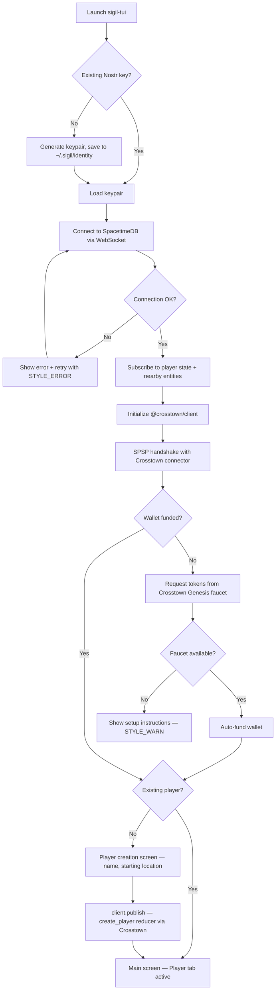

# UX Design Specification — Sigil

**Author:** Jonathan
**Date:** 2026-02-25

---

## Executive Summary

### Project Vision

Sigil is a TypeScript SDK platform with a Rust terminal frontend that enables both human players and AI agents to interact with the BitCraft game world through a shared infrastructure. The platform provides three consumer interfaces over a single engine (`@sigil/client`):

- **MCP Server** (`@sigil/mcp-server`) — for AI agents via Claude, Vercel AI SDK, etc.
- **TUI Backend** (`@sigil/tui-backend`) — JSON-RPC IPC bridge to the Rust terminal UI
- **Direct Import** — for custom TypeScript applications

The vision is a research-grade platform where AI agents and humans coexist in a real MMO economy, with every interaction metered through micropayments (ILP/Crosstown) and authenticated via Nostr identity.

### Target Users

**Primary Personas:**

1. **Marcus — The AI Researcher** — PhD-level, wants to study emergent AI behavior in real economic systems. Needs programmatic access, experiment logging, and observable agent decision-making. Interacts primarily through MCP tools or direct SDK import.

2. **Sarah — The Power Player** — Experienced gamer who wants terminal-based efficiency. Prefers keyboard-driven workflows, real-time data visibility, and multi-character management. Interacts through the Rust TUI (`sigil-tui`).

3. **Alex — The Indie Builder** — Developer building custom bots/tools on top of Sigil's SDK. Needs clean APIs, good documentation, and composable primitives. Imports `@sigil/client` directly.

**Technical Profile:** All users are technically sophisticated — researchers, power gamers, and developers. No casual/non-technical users in the initial target.

### Key Design Challenges

1. **Terminal UI within ratatui constraints** — The TUI must present ~80 entity tables + real-time game state within terminal rendering limits. Complex data (hex grid map, inventories, crafting trees) needs effective information hierarchy in a character-cell grid.

2. **Dual interaction paradigm** — AI agents (text commands via MCP) and human players (keyboard-driven TUI) share the same underlying client but have fundamentally different interaction models. UX patterns must serve both without compromising either.

3. **Real-time data density** — SpacetimeDB subscriptions push continuous updates. The TUI must handle high-frequency state changes without overwhelming the user — dirty flags, tick-based rendering, and smart update coalescing are critical.

4. **Micropayment friction** — Every write action costs ILP micropayments. Users need clear cost awareness and budget tracking without it becoming a UX burden on every action.

5. **Identity complexity** — Nostr keypair management (generation, backup, recovery) must be seamless. Users shouldn't need to understand the Nostr → BLS → SpacetimeDB propagation chain.

### Design Opportunities

1. **Terminal aesthetics as differentiator** — Following rebels-in-the-sky patterns (Screen trait, widget composition, event-driven architecture), the TUI can achieve a distinctive, polished terminal aesthetic that sets Sigil apart from typical CLI tools.

2. **AI-observable UX** — Since AI agents and humans share the same client, the TUI can visualize agent decision-making in real-time — showing what the AI "sees," its action costs, and skill execution. This is unique research UX.

3. **Skill file as UX primitive** — The markdown-based skill DSL can serve as both documentation and executable UI. Skills could render as contextual action menus in the TUI, with cost/prerequisite info inline.

4. **Progressive disclosure for data complexity** — 228 tables (80 entity + 148 static) is overwhelming. A well-designed tab/panel system with search, filtering, and drill-down can turn data density into a power-user advantage.

## Core User Experience

### Defining Experience

The **game action loop** is Sigil's defining interaction — the cycle of perceiving world state, deciding on an action, executing it, and observing the outcome. This loop is the core for all three personas:

- **Sarah (TUI):** Sees hex grid/inventory/player state → chooses action via keyboard → executes (move, craft, trade) → sees world update in real-time
- **Marcus (MCP/SDK):** Configures agent with skills → agent perceives state via subscriptions → agent executes actions → researcher observes decisions + outcomes in logs
- **Alex (Direct Import):** Reads game state from `client.spacetimedb` → calls `client.publish()` → observes reducer result via subscription callback

All three share the same underlying loop through `@sigil/client` — only the presentation layer differs.

### Platform Strategy

- **Terminal application, always-online** — no offline mode. SSH play is a supported use case (terminal-native design enables remote play over SSH)
- **Keyboard-driven** via ratatui/crossterm, following rebels-in-the-sky patterns (Screen trait, event loop, widget composition)
- **Terminal requirements:** minimum dimensions TBD during implementation, truecolor preferred with 256-color fallback, mouse support optional (keyboard-first)
- **Data transport:** WebSocket for reads (SpacetimeDB subscriptions), HTTP for writes (ILP packets)
- **AI agents connect via MCP protocol** — no terminal UI needed, tool-based interaction

### Effortless Interactions

1. **Connection & identity** — First launch should generate a Nostr keypair and connect to SpacetimeDB in seconds. Zero configuration for "just start playing."
2. **Action cost awareness** — ILP micropayment costs should be visible but non-intrusive. A persistent wallet/budget indicator, not a confirmation dialog on every action.
3. **State comprehension** — Real-time subscription updates should render meaningfully without user effort. Dirty flags and tick-based rendering keep the display current without flicker or overwhelm.
4. **Skill discovery** — Available actions (from skill files) should surface contextually based on current game state, not require memorization.

### Critical Success Moments

1. **First action succeeds** — User issues their first game command, sees the world respond. This is the "it works" moment. Must happen within minutes of first launch.
2. **First agent observation** — Marcus sees his AI agent make an autonomous decision with cost, reasoning, and outcome visible. The "this is real research" moment.
3. **Flow state in TUI** — Sarah navigates, acts, and manages multiple concerns without leaving the keyboard. The "this is faster than a GUI" moment.
4. **Cost surprise avoided** — User never accidentally spends more than expected. Budget visibility prevents the "wait, that cost HOW much?" anti-moment.

### Experience Principles

1. **Loop speed is everything** — Minimize latency and friction in the see→decide→act→observe cycle. Every extra keystroke or delay degrades the core experience.
2. **Data density, not data overload** — Show maximum useful information in minimum space. Progressive disclosure: summary by default, detail on demand.
3. **Cost transparency without friction** — Micropayments are always visible, never blocking. Users stay informed about spend without confirmation fatigue.
4. **One engine, tailored surfaces** — `@sigil/client` is the single source of truth. Each interface (TUI, MCP, direct) optimizes for its persona without diverging from the shared model.

## Desired Emotional Response

### Primary Emotional Goals

**Mastery and control** is the defining emotional target for Sigil. Users should feel like the terminal interface amplifies their capabilities — that they can perceive, decide, and act faster and more precisely than through any graphical alternative.

Supporting emotional goals:

- **Scientific confidence** — For researchers, the platform feels rigorous and trustworthy. Data is real, actions have real costs, observations are complete and reproducible.
- **Builder empowerment** — For developers, the SDK feels like leverage. Clean primitives that compose without friction, letting them build powerful custom tools quickly.
- **Discovery** — The "whoa" moment of watching an AI agent operate autonomously in a real economy with real micropayment costs. This is unique to Sigil.

### Emotional Journey Mapping

| Stage                | Desired Emotion                                            | Anti-Emotion to Avoid                                 |
| -------------------- | ---------------------------------------------------------- | ----------------------------------------------------- |
| **First launch**     | Immediate capability — "I'm connected, I can act"          | Confusion — "what do I do now?"                       |
| **Core loop**        | Flow and mastery — "I'm in control of this world"          | Overwhelm — "there's too much data"                   |
| **Action execution** | Confidence — "that worked, I can see the result"           | Distrust — "did it actually happen?"                  |
| **Cost/payment**     | Awareness — "I know what this costs"                       | Anxiety — "am I spending too much?"                   |
| **Error/failure**    | Understanding — "I know what went wrong and how to fix it" | Helplessness — "something broke and I don't know why" |
| **Return session**   | Continuity — "I'm right back where I left off"             | Disorientation — "what was I doing?"                  |

### Micro-Emotions

**Critical pair: Confidence vs. Confusion** — Every interaction should reinforce that the user understands what's happening. State changes are visible, action results are immediate, costs are transparent. This is the micro-emotion that makes or breaks the mastery feeling.

**Secondary pair: Accomplishment vs. Frustration** — The game action loop should produce a small hit of accomplishment on each successful cycle. Failed actions must explain why clearly enough to convert frustration into problem-solving.

**Tertiary pair: Trust vs. Skepticism** — Real-time data from SpacetimeDB subscriptions must feel live and authoritative. Connection status, data freshness indicators, and action confirmations build trust in the system.

### Design Implications

- **Mastery** → Reward expertise with progressive keyboard shortcuts, command chaining, and customizable layouts. Never gate advanced functionality behind wizards or tutorials.
- **Confidence** → Immediate visual feedback on every action. Show action result inline, not in a separate log panel the user has to check.
- **Cost awareness without anxiety** → Persistent wallet indicator (like a battery meter), not per-action confirmation dialogs. Show cumulative session spend, not just per-action cost.
- **Trust** → Connection status always visible. Stale data flagged automatically. Action receipt confirmation from SpacetimeDB displayed.
- **Flow preservation** → Minimize modal interruptions. Errors appear inline or in a non-blocking notification area. Never force the user out of their current context.

### Emotional Design Principles

1. **Mastery scales with investment** — The interface should be usable immediately but reveal deeper capability as users invest time. First session: basic commands. Week two: keyboard shortcuts and custom workflows. Month one: the user feels like a virtuoso.
2. **Never surprise with cost** — Financial transparency is an emotional safety net. Users should always be able to predict what an action will cost before executing it.
3. **Errors are conversations, not dead ends** — Every error should explain what happened, why, and what the user can do about it. The emotional goal is "I understand" not "it broke."
4. **Speed is an emotion** — Sub-second response times on the action loop don't just feel fast, they feel _powerful_. Latency is the enemy of mastery.

## UX Pattern Analysis & Inspiration

### Inspiring Products Analysis

**vim/neovim — Mastery Through Modal Composability**

- Core strength: Composable command grammar (verb + modifier + object) creates an exponential capability curve. Users who invest time become dramatically faster than any alternative.
- Onboarding: Intentionally steep — but the reward curve justifies it. Sigil should find a middle ground: usable on day one, but with the same depth of mastery available.
- Key lesson: **Commands should compose.** A small set of well-designed primitives that combine into complex operations feels more powerful than a large set of single-purpose commands.

**htop/btop — Data Density Done Right**

- Core strength: Displays enormous amounts of real-time system data in a single terminal screen without feeling overwhelming. Color coding, sparklines, bar charts, and careful layout create instant comprehension.
- Navigation: Minimal — the default view already shows what you need. Drill-down is available but rarely required.
- Key lesson: **The default view should answer the most common question without any interaction.** Color and visual hierarchy do the heavy lifting, not user navigation.

**lazygit — Complex Workflows Made Effortless**

- Core strength: Takes git's notoriously complex CLI and presents it as contextual panels with keyboard navigation. Every action is visible, discoverable, and reversible.
- Interaction model: Panel-based navigation with contextual actions. The current panel determines what keys do. Status bar shows available commands.
- Key lesson: **Contextual action menus eliminate memorization.** Show what's possible right now, not everything that's possible ever.

**rebels-in-the-sky — Reference TUI Architecture**

- Core strength: Screen trait pattern with clean separation between UI state and render logic. Event-driven architecture with tick-based rendering.
- Patterns already documented: `Screen` trait, widget composition, `EventLoop`, `AppState` management.
- Key lesson: **Proven architecture patterns for our exact tech stack.** Not just inspiration — direct implementation reference.

### Transferable UX Patterns

**Navigation Patterns:**

- **Panel-based layout** (lazygit) — Primary content + contextual sidebar + status bar. Panels resize and rearrange based on current activity. Maps directly to Sigil's game view + inventory + action panel needs.
- **Modal context switching** (vim) — Different "modes" for different activities (exploring map, managing inventory, crafting, trading). Each mode optimizes the keyboard layout for that activity.

**Interaction Patterns:**

- **Contextual key hints** (lazygit) — Bottom status bar shows available keys for the current context. Eliminates the need to memorize keybindings while preserving speed for experts who already know them.
- **Composable commands** (vim) — Rather than one key per action, allow command composition. E.g., `m` for move + direction, `c` for craft + recipe selection. Small grammar, large action space.
- **Inline feedback** (htop) — Action results appear in-place, not in a separate log. When you kill a process in htop, it disappears from the list. When Sigil executes a move, the player position updates on the map.

**Visual Patterns:**

- **Color-as-information** (htop/btop) — Color encodes meaning: green = healthy, red = critical, yellow = warning. Apply to Sigil: wallet balance color shifts as budget depletes, connection status color, action cost severity.
- **Sparklines and compact indicators** (btop) — Dense data in minimal space. Apply to wallet balance trend, subscription connection health, tick rate.

### Anti-Patterns to Avoid

- **Confirmation dialogs on routine actions** — Breaks flow state. Micropayment actions should execute immediately with visible cost, not prompt "Are you sure?" on every move.
- **Hidden status information** — If connection drops or data is stale, the user must know immediately. Never hide system state behind a menu or command.
- **Flat key listings without context** — A help screen that lists 200 keybindings is useless. Keys must be contextual to current mode/panel.
- **Scrolling text logs as primary feedback** — Log panels are supplementary. Primary action feedback must be visual and in-place, not "check the log."
- **Mouse-first design retrofitted to keyboard** — The TUI must be designed keyboard-first. Mouse support (if any) is supplementary, never required.

### Design Inspiration Strategy

**Adopt:**

- Panel-based layout with contextual actions (lazygit model)
- Contextual key hints in status bar
- Color-as-information for system state (wallet, connection, data freshness)
- rebels-in-the-sky Screen trait and event loop architecture directly

**Adapt:**

- vim's modal composability — simplified for game actions rather than text editing. Fewer modes, but each mode has its own optimized key layout.
- htop's data density — applied to game state (228 tables distilled into meaningful views, not raw data dumps)

**Avoid:**

- Confirmation dialogs on routine game actions
- Mouse-dependent interactions
- Flat help screens / keybinding cheat sheets without context
- Log-only feedback for action results

## Design System Foundation

### Design System Choice

**Custom TUI design system built on ratatui's widget library** — no web design system applies. The design system is a layered approach:

1. **ratatui built-in widgets** as the base component library
2. **Custom game widgets** built on ratatui primitives following the `Widget` trait
3. **Semantic style token system** for visual consistency across all screens

### Rationale for Selection

- **No alternative exists** — There is no "Material Design for terminals." ratatui's widget library is the closest equivalent to a component framework, and it's already the chosen rendering library.
- **rebels-in-the-sky provides patterns** — Screen trait, widget composition, and event loop patterns are already documented and proven for this exact stack.
- **Solo developer** — A lightweight token system is maintainable. A heavy abstraction layer would be overhead with no team coordination benefit.
- **Keyboard-first constraints** — Terminal UI design systems must account for focus management, keyboard navigation, and mode indication — concerns that web design systems handle differently.

### Implementation Approach

**Layer 1 — ratatui Built-in Widgets (use directly):**

| Widget      | Sigil Use Case                          |
| ----------- | --------------------------------------- |
| `Block`     | Panel borders, titles, focus indicators |
| `Paragraph` | Text content, descriptions, logs        |
| `Table`     | Inventory, player stats, entity lists   |
| `List`      | Action menus, skill lists, chat         |
| `Tabs`      | Screen/mode switching                   |
| `Gauge`     | Wallet balance, health bars, progress   |
| `Sparkline` | Tick rate, connection latency trend     |
| `Layout`    | Constraint-based panel arrangement      |

**Layer 2 — Custom Game Widgets (build on primitives):**

| Widget            | Purpose                                                 | Base                      |
| ----------------- | ------------------------------------------------------- | ------------------------- |
| `HexGrid`         | Game world map rendering                                | `Canvas` or raw `Buffer`  |
| `ActionMenu`      | Contextual skill/action list with costs and keybindings | `List` + custom rendering |
| `WalletMeter`     | ILP balance with color-coded threshold                  | `Gauge` + style tokens    |
| `ConnectionBadge` | SpacetimeDB/Crosstown connection status                 | `Span` + style tokens     |
| `CostPreview`     | Inline action cost before execution                     | Custom `Span` composition |

**Layer 3 — Screen Composition (rebels-in-the-sky pattern):**

Each screen implements the `Screen` trait with `handle_event()`, `update()`, and `render()`. Screens compose Layer 1 and Layer 2 widgets into full layouts.

### Customization Strategy

**Semantic Style Token System:**

```
// Color tokens — semantic, not literal
const STYLE_OK: Style        // green — healthy state, successful action
const STYLE_WARN: Style      // yellow — budget low, latency high
const STYLE_ERROR: Style     // red — connection lost, action failed
const STYLE_COST: Style      // cyan — micropayment amounts
const STYLE_IDENTITY: Style  // magenta — Nostr pubkey, player identity
const STYLE_MUTED: Style     // dark gray — secondary info, timestamps
const STYLE_FOCUS: Style     // bold + border highlight — active panel/input
const STYLE_HINT: Style      // dim — keybinding hints in status bar
```

**Layout Tokens:**

- Standard panel margins and padding (1-cell border)
- Consistent constraint ratios for common layouts (70/30 main/sidebar, 80/20 content/status)
- Focus border style (double-line for active, single-line for inactive)

**Typography Tokens (terminal-constrained):**

- Bold for headers and active elements
- Dim for secondary/hint text
- Italic for system messages (where terminal supports it)
- Underline for interactive/selectable items

## Defining Core Experience

### Defining Experience

**"Command a character in a live MMO economy from your terminal."**

The defining experience is the game action loop executed through a keyboard-first, panel-based terminal interface. Users perceive game state across focused panels, issue commands through modal keyboard interactions, and see the world respond in real-time — all without touching a mouse.

This is not a game client that happens to run in a terminal. It's a terminal power tool that happens to operate on a game world.

### User Mental Model

**Primary mental model: Terminal power user** (vim, tmux, lazygit)

Users approach Sigil with the expectation of:

- **Panels** — Multiple panes of information visible simultaneously, with one focused/active
- **Modal interaction** — Current mode determines what keys do. Mode is always visibly indicated.
- **Keyboard commands** — Every action reachable by keyboard. No interaction requires a mouse.
- **Composability** — Small commands combine into complex operations
- **Configurability** — Keybindings, layouts, and workflows are customizable over time

**What this mental model implies for design:**

- Users expect `hjkl` or arrow keys for navigation between panels
- Users expect a command/search palette (like `:` in vim or `ctrl-p` in lazygit)
- Users expect tab/shift-tab or bracket keys to cycle between panels
- Users expect status information in a persistent bar (like tmux status line)
- Users do NOT expect tooltips, hover states, or click targets

### Success Criteria

| Criterion                           | Measure                                                                                                                                  |
| ----------------------------------- | ---------------------------------------------------------------------------------------------------------------------------------------- |
| **First action under 2 minutes**    | From launch to first successful game command (identity auto-generated, default subscriptions connected)                                  |
| **Core loop under 3 keystrokes**    | Navigate to target → execute action → see result. No intermediate confirmations.                                                         |
| **Zero mouse dependency**           | Every feature reachable by keyboard. Mouse support allowed but never required.                                                           |
| **State comprehension at a glance** | Player position, wallet balance, connection status, and available actions visible on the default screen without scrolling or navigating. |
| **Action cost always predictable**  | Cost shown before execution (in action menu or status bar), never only after.                                                            |

### Novel UX Patterns

**Blend of established terminal patterns with novel game context:**

This is established patterns applied to a novel domain. No new interaction paradigms need invention — the innovation is applying terminal power-user patterns to MMO gameplay.

**Established patterns (adopt directly):**

- Panel-based layout with focus management (tmux/lazygit)
- Modal key contexts (vim)
- Contextual key hints in status bar (lazygit)
- Command palette for search/discovery (vim `:`, VSCode `ctrl-p`)

**Novel adaptations (familiar pattern, new context):**

- **Skill actions as command palette entries** — Skill files render as searchable, filterable actions with cost annotations. Like vim commands but for game actions.
- **Hex grid in a terminal panel** — No established pattern exists for hex map rendering in a terminal. Custom widget, but navigation follows standard `hjkl`/arrow key expectations.
- **Real-time subscription state as panel content** — Unlike static file content in vim, Sigil's panels update continuously from SpacetimeDB. The pattern is familiar (panels with data) but the data is live.

### Experience Mechanics

**1. Initiation — Entering the Loop:**

- Launch `sigil-tui` → auto-generates Nostr identity on first run (or loads existing)
- Connects to SpacetimeDB via WebSocket, subscribes to player state + nearby entities
- Default screen renders: hex grid (center), player stats (sidebar), action menu (bottom), status bar (wallet + connection)
- User is immediately in "navigation mode" — arrow keys move map focus

**2. Interaction — Executing Actions:**

- User navigates to a target (hex, entity, inventory item) using keyboard
- Presses action key or opens command palette to see available actions
- Action menu shows: action name, keybinding, ILP cost, prerequisites
- User selects action → `client.publish()` fires ILP packet

**3. Feedback — Confirming Results:**

- Status bar flashes action confirmation with cost deducted
- Game state updates arrive via SpacetimeDB subscription within milliseconds
- Affected panel(s) re-render with new state (player position moves, inventory changes, etc.)
- Wallet balance updates inline
- If action fails: inline error message with reason, styled with `STYLE_ERROR`

**4. Completion — Loop Continues:**

- No "done" state — the loop is continuous
- User is immediately ready for next action
- Previous action result is visible as updated state, not as a notification to dismiss
- Session ends when user quits (`q` or `:q`)

## Visual Design Foundation

### Design Principle: Reuse rebels-in-the-sky

Sigil's TUI inherits its visual foundation directly from rebels-in-the-sky. The existing codebase provides a proven, complete terminal UI system for a real-time game — the same problem domain Sigil operates in. Rather than designing from scratch, Sigil reuses:

- **`UiStyle` struct** (`ui/constants.rs`) — All const Style definitions (SELECTED, HIGHLIGHT, HEADER, OK, WARNING, ERROR, UNSELECTABLE, SHADOW, etc.)
- **`UiStyled` trait** (`ui/traits.rs`) — Trait-based semantic styling for game entities and data types
- **Color palette** — RGB truecolor values with named ANSI fallbacks
- **Screen trait pattern** — `handle_event()`, `update()`, `render()` composition
- **Widget patterns** — Panel borders, list rendering, table layouts, status bars
- **Layout patterns** — Constraint-based ratatui layouts for panel arrangement

### Sigil-Specific Extensions

Only add new style tokens where Sigil has concepts rebels-in-the-sky doesn't:

| Token                                                      | Color                                         | Reason                                                     |
| ---------------------------------------------------------- | --------------------------------------------- | ---------------------------------------------------------- |
| `COST`                                                     | RGB(64, 224, 208) — reuse rebels' FUEL teal   | ILP micropayment amounts (no equivalent in rebels)         |
| `WALLET_OK` / `WALLET_LOW` / `WALLET_CRITICAL`             | Green / Yellow / Red — reuse OK/WARNING/ERROR | Budget threshold indicators (no wallet in rebels)          |
| `IDENTITY`                                                 | LightMagenta — reuse rebels' SHIELD           | Nostr pubkey display                                       |
| `CONNECTION_LIVE` / `CONNECTION_STALE` / `CONNECTION_DEAD` | Reuse OWN_TEAM / NETWORK / DISCONNECTED       | SpacetimeDB connection status (rebels has similar pattern) |
| `HINT`                                                     | DarkGray — reuse UNSELECTABLE                 | Keybinding hints in status bar                             |

### What's NOT Reused

- **Player image rendering / color maps** — rebels-in-the-sky's pixel-art color mapping system (jersey colors, skin tones, hair colors) is specific to its space pirate theme. Sigil's BitCraft entities have different visual needs.
- **Game-specific trait colors** (Killer=Red, Showpirate=Magenta, etc.) — replaced with Sigil's own game entity categorization.

### Accessibility

Inherited from rebels-in-the-sky's approach: RGB with named fallbacks, text labels alongside color indicators, bold + color for emphasis. Sigil adds: enforced minimum terminal size check at startup.

## Design Direction

### Design Principle: Follow rebels-in-the-sky Screen Architecture

Sigil adopts rebels-in-the-sky's proven screen organization wholesale, adapting tab content for BitCraft gameplay.

### Screen Architecture

**Fixed viewport:** 160x48 characters, centered in terminal.

**Main layout (vertical):**

```
┌─────────────────────────────────────────────────────────────┐
│  [Tab1] [Tab2] [Tab3] [Tab4] [Tab5] [Tab6]    (3 rows)    │
├─────────────────────────────────────────────────────────────┤
│                                                             │
│           Active tab content (remaining space)              │
│                                                             │
├─────────────────────────────────────────────────────────────┤
│  key hints from active screen                    (1 row)   │
├─────────────────────────────────────────────────────────────┤
│  hover/context text                              (1 row)   │
└─────────────────────────────────────────────────────────────┘
```

**Matching rebels-in-the-sky constraints:**

```rust
Layout::vertical([
    Constraint::Min(6),     // body (tabs + active panel)
    Constraint::Length(1),  // footer (key hints)
    Constraint::Length(1),  // hover text
])
```

### Navigation Model (directly from rebels-in-the-sky)

- **UiState** — Top-level state machine (Splash → Setup → Main)
- **UiTab** — Tab switching within Main (Tab/BackTab keys, 16 chars per tab button)
- **SplitPanel** — List selection within each tab (Up/Down arrow keys, wrapping)
- **UiCallback** — Inter-tab navigation (e.g., clicking a player name jumps to Player tab with that player selected)
- **CallbackRegistry** — Hotkey fallback after active screen handles keys

### Screen Trait (reused directly)

```rust
pub trait Screen {
    fn update(&mut self, world: &World) -> AppResult<()>;
    fn render(&mut self, frame: &mut UiFrame, world: &World, area: Rect, debug_view: bool) -> AppResult<()>;
    fn handle_key_events(&mut self, key_event: KeyEvent, world: &World) -> Option<UiCallback> { None }
    fn footer_spans(&self) -> Vec<String> { vec![] }
}

pub trait SplitPanel {
    fn index(&self) -> Option<usize> { None }
    fn max_index(&self) -> usize { 0 }
    fn set_index(&mut self, index: usize) {}
    fn previous_index(&mut self) { /* wrapping dec */ }
    fn next_index(&mut self) { /* wrapping inc */ }
}
```

### Sigil Tab Layout

Mapped from rebels-in-the-sky's tabs to BitCraft game concepts:

| rebels-in-the-sky Tab | Sigil Tab   | Content                                       |
| --------------------- | ----------- | --------------------------------------------- |
| MyTeam                | **Player**  | Player stats, inventory, equipment, skills    |
| Crews                 | **Nearby**  | Nearby entities, other players, NPCs          |
| Pirates               | **World**   | Entity browser (all players, buildings, etc.) |
| Galaxy                | **Map**     | Hex grid world map with zoom                  |
| Games                 | **Actions** | Action log, pending actions, history          |
| Tournaments           | **Economy** | Market, trading, crafting recipes             |
| Swarm                 | **System**  | Connection status, wallet, logs, settings     |

Tabs use the same pattern: left-right split with list on left, detail on right. Each implements Screen + SplitPanel traits.

### Panel Layout Pattern (reused from rebels-in-the-sky)

Most tabs follow the standard left-right split:

```rust
Layout::horizontal([
    Constraint::Length(LEFT_PANEL_WIDTH),  // List
    Constraint::Min(IMG_FRAME_WIDTH),      // Detail
])
```

**Map tab** is the exception — uses full-width hex grid rendering (like rebels' GalaxyPanel zoom-out mode).

### What's Adapted (Not Copied)

- **Tab names and content** — BitCraft game concepts replace space pirate concepts
- **Detail views** — BitCraft entity data replaces player/team images
- **Hex grid widget** — New custom widget (rebels uses star map, Sigil needs hex grid)
- **Status bar content** — Wallet balance + connection status + mode indicator (rebels has audio controls + debug info)
- **`World` struct contents** — Sigil's World holds SpacetimeDB state, not rebels' game state

## User Journey Flows

### Journey 1: First Launch (All Personas)

**Maps to rebels-in-the-sky: Splash → NewTeam → Main state machine**



**Key UX decisions:**

- Identity auto-generated on first launch — zero config
- Crosstown SPSP handshake happens automatically after SpacetimeDB connects
- Wallet funding via Genesis faucet is automatic when available
- If faucet unavailable, display setup instructions (infrastructure concern, not normal UX flow)
- Connection errors show inline with retry, never a modal
- Existing players skip straight to Main — under 5 seconds

### Journey 2: Sarah's Game Action Loop (TUI Core)

**Maps to rebels-in-the-sky: Main state tab navigation + SplitPanel interaction**

```mermaid
flowchart TD
    A[Main screen — any tab] --> B[Navigate via Tab/BackTab to target tab]
    B --> C[Browse list via Up/Down arrows]
    C --> D[View detail in right panel]
    D --> E{Action available?}
    E -->|Yes| F[Footer shows available keys + costs]
    F --> G[Press action key]
    G --> H[Cost preview shown in hover text]
    H --> I[@crosstown/client sends ILP packet]
    I --> J{Action result?}
    J -->|Success| K[SpacetimeDB subscription updates panels]
    J -->|Insufficient funds| L[STYLE_WALLET_CRITICAL in status — needs funding]
    J -->|Other failure| M[Inline error with STYLE_ERROR in hover text]
    K --> A
    L --> A
    M --> A
```

**Key UX decisions:**

- Tab/BackTab cycles tabs (rebels' exact pattern)
- Up/Down selects within list (SplitPanel trait)
- Action keys shown in footer (rebels' `footer_spans()`)
- Cost displayed before execution in hover text row
- All writes go through `@crosstown/client` — ILP packet → BLS → SpacetimeDB
- Wallet balance in status bar reflects Crosstown client funded balance (WALLET_OK / WALLET_LOW / WALLET_CRITICAL)
- Results appear as state updates in panels, not notifications
- Insufficient funds is a distinct state — user needs to refund via faucet or setup scripts

### Journey 3: Marcus's Agent Setup (MCP)

**No TUI equivalent in rebels-in-the-sky — SDK/MCP only**

```mermaid
flowchart TD
    A[Install @sigil/mcp-server] --> B[Configure MCP in claude_desktop_config.json]
    B --> C[Agent connects — MCP handshake]
    C --> D[MCP server spawns @sigil/client instance]
    D --> E[Auto-generates or loads Nostr identity]
    E --> F[Connects to SpacetimeDB + subscribes]
    F --> G[Initialize @crosstown/client + SPSP handshake + fund from faucet]
    G --> H[Agent calls MCP tools — get_player_state, get_nearby_entities]
    H --> I[Agent decides action via skill files]
    I --> J[Agent calls execute_action tool]
    J --> K[@crosstown/client sends ILP packet]
    K --> L{Result?}
    L -->|Success| M[MCP returns updated state to agent]
    L -->|Fail| N[MCP returns error with reason]
    M --> H
    N --> H
```

**Key UX decisions:**

- Agent uses same `@sigil/client` + `@crosstown/client` as TUI — identical write path
- MCP tools use snake_case naming convention (per architecture decision)
- Crosstown funding via Genesis faucet is automatic for agents
- Agent loop is autonomous — no human confirmation needed
- Researcher observes via TUI's System tab or JSONL decision logs

### Journey Patterns

**Common across all journeys:**

| Pattern                        | Implementation                                                               | Source                        |
| ------------------------------ | ---------------------------------------------------------------------------- | ----------------------------- |
| **State machine progression**  | `UiState` enum drives screen flow                                            | rebels-in-the-sky             |
| **List → Detail → Action**     | SplitPanel left list, right detail, footer actions                           | rebels-in-the-sky             |
| **Non-blocking errors**        | Errors in hover text row, user stays in context                              | Experience Principle #3       |
| **Immediate state reflection** | SpacetimeDB subscription updates render automatically                        | Core loop design              |
| **Cost before commit**         | Action cost shown in footer/hover before key press                           | Emotional Design Principle #2 |
| **Single write path**          | All writes: `client.publish()` → `@crosstown/client` ILP → BLS → SpacetimeDB | Architecture                  |
| **Auto-fund from faucet**      | Crosstown Genesis faucet funds wallets automatically when available          | Infrastructure                |

### Flow Optimization Principles

1. **Minimize state transitions** — Keep users on Main screen as much as possible. Tab switching is cheaper than screen transitions.
2. **Footer as command palette** — Active screen's `footer_spans()` replaces the need for a separate help system. Context-specific, always visible.
3. **UiCallback for cross-tab jumps** — Selecting an entity in any tab can jump to its detail in another tab (rebels' `GoToPlayer`/`GoToTeam` pattern). Reduces manual navigation.
4. **Dirty flags for efficient updates** — Only re-render panels whose underlying data changed. Inherited from rebels-in-the-sky's tick-based update system.

## Component Strategy

### Design System Components (reused from rebels-in-the-sky)

| Component                     | rebels-in-the-sky Source         | Sigil Usage                                    |
| ----------------------------- | -------------------------------- | ---------------------------------------------- |
| Screen trait + SplitPanel     | `ui/traits.rs`                   | All tab screens                                |
| UiCallback + CallbackRegistry | `ui/ui_callback.rs`              | Action dispatch, cross-tab navigation          |
| Tab bar rendering             | `ui/ui_screen.rs`                | Main screen tab row                            |
| List with selection           | SplitPanel index management      | Entity lists, inventory, action lists          |
| Table rendering               | ratatui `Table` widget           | Player stats, entity data, market prices       |
| Footer key hints              | `footer_spans()` on Screen trait | Contextual keybinding display                  |
| Hover text row                | `ui/ui_screen.rs` render         | Action descriptions, cost preview, errors      |
| Popup/modal                   | Popup pattern in rebels          | Confirmation dialogs (quit, dangerous actions) |
| Left-right split panel        | `Layout::horizontal` pattern     | List + detail view on most tabs                |
| Block borders with focus      | `UiStyle::SELECTED` border       | Active vs inactive panel indication            |

### Custom Components (Sigil-specific)

**HexGrid**

- **Purpose:** Render BitCraft hex world map with player position, nearby entities, terrain
- **Base:** ratatui `Canvas` widget or direct `Buffer` manipulation
- **States:** Centered on player (default), free-scroll mode, zoom levels
- **Interaction:** Arrow keys pan, enter selects hex, footer shows hex details
- **Used in:** Map tab (full-width, no left-right split)

**WalletMeter**

- **Purpose:** Display Crosstown client funded balance with threshold coloring
- **Base:** ratatui `Gauge` + semantic style tokens
- **States:** WALLET_OK (green, > 50%), WALLET_LOW (yellow, 10-50%), WALLET_CRITICAL (red, < 10%)
- **Interaction:** Read-only display in status bar footer
- **Used in:** Status bar (persistent across all tabs)

**ConnectionBadge**

- **Purpose:** Show SpacetimeDB WebSocket + Crosstown SPSP connection status
- **Base:** Styled `Span` with icon character
- **States:** CONNECTION_LIVE (green), CONNECTION_STALE (purple, high latency), CONNECTION_DEAD (gray, disconnected)
- **Interaction:** Read-only display in status bar footer
- **Used in:** Status bar (persistent across all tabs)

**CostPreview**

- **Purpose:** Show ILP cost of action before execution
- **Base:** Styled `Span` composition with COST token color
- **States:** Affordable (teal), unaffordable (red + strikethrough)
- **Interaction:** Appears in hover text row when action key is highlighted in footer
- **Used in:** Hover text row (contextual, appears/disappears with action focus)

### Component Implementation Strategy

**Principle: Copy rebels-in-the-sky patterns, not code.**

rebels-in-the-sky is a reference implementation, not a library. Sigil reimplements the same patterns (Screen trait, SplitPanel, UiCallback, UiStyle) in its own codebase, adapted for BitCraft data types. The four custom widgets are built on ratatui primitives following the same `Widget` trait pattern rebels uses for its custom widgets.

### Implementation Roadmap

**Phase 1 — MVP (required for first playable):**

- Screen + SplitPanel traits (copied from rebels pattern)
- UiStyle + UiStyled (copied from rebels, extended with Sigil tokens)
- UiCallback + CallbackRegistry (copied from rebels pattern)
- Tab bar + footer + hover text (copied from rebels `ui_screen.rs` pattern)
- Player tab (first SplitPanel implementation)
- ConnectionBadge (need to see connection status immediately)
- WalletMeter (need to see funded balance before acting)

**Phase 2 — Core gameplay:**

- Map tab + HexGrid widget (custom, most complex widget)
- CostPreview (appears once actions are available)
- Nearby tab, World tab (more SplitPanel implementations)
- Actions tab (action log/history)

**Phase 3 — Full experience:**

- Economy tab (market, trading, crafting)
- System tab (logs, settings, agent observation)
- Popup/modal patterns (quit confirmation, dangerous action confirmation)
- UiCallback cross-tab navigation (GoToPlayer, GoToEntity equivalents)

## UX Consistency Patterns

### Key Input Hierarchy

**Routing priority (directly from rebels-in-the-sky):**

1. **ESC** → Quit confirmation popup (always, regardless of context)
2. **Tab / BackTab** → Tab navigation (unless popup is active)
3. **Popup input** → If popup visible, popup consumes all other keys
4. **Active screen `handle_key_events()`** → Screen-specific keys
5. **CallbackRegistry hotkey fallback** → Global hotkeys

**Consistency rule:** A key's behavior is always determined by the highest-priority handler that claims it. Users can always predict what a key does by knowing what context they're in.

### Feedback Patterns

| Feedback Type         | Location                      | Style                                          | Duration                         |
| --------------------- | ----------------------------- | ---------------------------------------------- | -------------------------------- |
| **Action success**    | State updates in panels       | No explicit message — panels reflect new state | Persistent (state change)        |
| **Action error**      | Hover text row                | `STYLE_ERROR` + reason text                    | Until next action or key press   |
| **Warning**           | Hover text row                | `STYLE_WARN` + message                         | Until next action or key press   |
| **Connection change** | ConnectionBadge in status bar | Color shift                                    | Persistent until status changes  |
| **Wallet threshold**  | WalletMeter in status bar     | Color shift (OK → LOW → CRITICAL)              | Persistent until balance changes |
| **Informational**     | Hover text row                | Default style                                  | Until next action or key press   |

**Consistency rule:** Success is silent (state updates speak for themselves). Only errors and warnings get explicit messages. The hover text row is the single location for transient messages.

### Navigation Patterns

| Action         | Keys               | Behavior                                                |
| -------------- | ------------------ | ------------------------------------------------------- |
| Switch tabs    | Tab / BackTab      | Wrapping cycle through visible tabs                     |
| Scroll list    | Up / Down (or j/k) | Wrapping cycle through SplitPanel items                 |
| Select item    | Enter              | Opens detail view or triggers primary action            |
| Back / Cancel  | ESC                | Close popup, or trigger quit confirmation               |
| Cross-tab jump | UiCallback         | Selecting a linked entity jumps to its tab + selects it |
| Help           | ?                  | Show contextual help popup for current screen           |

**Consistency rule:** Same keys always do the same category of thing. Arrow keys always navigate within content. Tab always switches between tabs. Enter always confirms/selects.

### List Patterns

**All list-based panels follow SplitPanel trait conventions:**

- Wrapping navigation (Down on last item → first item)
- Selected item highlighted with `STYLE_SELECTED` background
- Detail for selected item renders in right panel
- Footer shows available actions for selected item
- Empty list shows centered message with `STYLE_MUTED`

### Loading & Empty States

| State               | Display                                                            |
| ------------------- | ------------------------------------------------------------------ |
| **Connecting**      | Centered "Connecting to SpacetimeDB..." with spinner character     |
| **Loading data**    | Panel shows "Loading..." with `STYLE_MUTED`                        |
| **Empty list**      | Centered "No [items] found" with `STYLE_MUTED`                     |
| **Disconnected**    | ConnectionBadge turns gray, hover text shows reconnection attempts |
| **Unfunded wallet** | WalletMeter empty + hover text with funding instructions           |

### Popup/Modal Patterns

**From rebels-in-the-sky popup system:**

- Popups overlay center of screen with bordered Block
- Background panels remain visible but dimmed
- Popup captures all key input until dismissed
- ESC or explicit cancel key dismisses popup
- Used sparingly — only for quit confirmation and irreversible actions

**Consistency rule:** Popups are rare. Most interactions are non-blocking (hover text, inline feedback). Only use popups when the user needs to explicitly confirm something destructive.

## Responsive Design & Accessibility

### Terminal Responsive Strategy

**No breakpoints, no mobile, no touch.** Sigil is a terminal application with a fixed 160x48 viewport (from rebels-in-the-sky). The only "responsive" concern is terminal size.

| Terminal Size | Behavior                                                                          |
| ------------- | --------------------------------------------------------------------------------- |
| **>= 160x48** | Full viewport, centered in terminal (rebels-in-the-sky pattern)                   |
| **< 160x48**  | Show clear error message: "Terminal too small. Requires 160x48, current: {w}x{h}" |

No layout reflow, no collapsing panels. The fixed viewport simplifies rendering and ensures consistent experience for all users.

### Accessibility Strategy

**Terminal accessibility is fundamentally different from web accessibility.** No WCAG compliance applies. No ARIA labels, no screen readers, no touch targets.

**What we can do:**

- **No color-only information** — Every status conveyed through text label + color, never color alone (already covered in Visual Foundation)
- **High contrast foreground colors** — All RGB values chosen for readability against dark terminal backgrounds
- **Named ANSI fallbacks** — Every truecolor RGB has a named color fallback for 256-color terminals
- **Keyboard-only by design** — The entire interface is keyboard-driven. No mouse required. This is inherently accessible for users who cannot use a mouse.
- **Consistent key behavior** — Same keys always do the same thing in the same context (covered in UX Patterns)
- **No animation dependencies** — No blinking, flashing, or animation that could cause issues. Tick-based rendering updates data, not decorative animation.

### Testing Strategy

- **Terminal diversity testing:** Test on common terminals (iTerm2, Terminal.app, Alacritty, Windows Terminal, kitty) for color rendering differences
- **256-color fallback testing:** Verify named color fallbacks render correctly on terminals without truecolor
- **Minimum size enforcement:** Verify the "terminal too small" message displays correctly
- **Keyboard-only testing:** Verify all flows completable without mouse (inherent to design, but verify no regressions)
